# Node.js Process Lifecycle

Alright, let's talk about the Node.js process lifecycle.

And I know what you're thinking. "Lifecycle? Isn't that some boring, academic thing?" Most engineers think a Node service is just one command: `node server.js`. They assume `require()` is free, `process.exit()` is a clean way to stop, and a single `SIGTERM` handler is all you need for "graceful shutdown."

I used to think that, too. And those assumptions are behind some of the worst production issues I've ever seen. I'm talking about data corruption during a simple deploy, services that get stuck in a crash loop under load, and memory leaks that trigger a cascade of OOM kills across an entire system.

The truth is, a Node.js process has a complex life, from the second you type `node` to its very last breath. And every single stage is a place where things can go spectacularly wrong.

This isn't just another chapter. This is a _in-depth_ guide to that lifecycle. We're going to dissect the whole journey: the C++ bootstrap that happens before your code even gets a look-in, the surprisingly expensive cost of `require()`, and the careful teamwork of a _true_ graceful shutdown. Forget a simple `try...catch`. We're talking about the reality of resource management - the file descriptors, sockets, and timers that can leak and bring your entire service down.

By the end of this, you'll finally understand _why_ your service takes forever to start, _why_ it sometimes corrupts data on restart, and _why_ it leaks handles. More importantly, you'll have a rock-solid framework for building Node.js apps that start fast, run reliably, and shut down cleanly.

This isn't about edge cases. This is core competence for any serious backend engineer. Ignoring the process lifecycle is choosing to build fragile systems. Respecting it is the first step toward building something that can actually survive in production.

## The Node.js Process Birth

When you type `node my_app.js`, you're kicking off this whole chain of events that happens long before a single line of your JavaScript ever runs. Most of us just take it for granted. Node just... starts, right?

Nope. It's actually a carefully choreographed dance between C++, the V8 engine, and an internal bootstrap script. And a lot of the weirdness you see - slow startups, weird environment issues - it all starts here.

The journey begins not in JavaScript, but inside the Node.js source code, in a C++ file. This is the _real_ entry point.

Here's the simplified sequence of what goes down in C++ land -

1. The processThe `main` function starts. It parses your command-line arguments (`--inspect`, `--max-old-space-size`, all that stuff) and sets up the basic process properties.
2. We've already talked about this but, node is built on Google's V8 engine, and the first thing it has to do is **wake it up**. This sets up shared resources like thread pools for background tasks (hello, garbage collection). This only happens once.
3. Then it creates a **V8 Isolate**. An **isolate** is a single, sandboxed instance of the V8 engine. It has its own memory heap and its own garbage collector. Think of it as a little planet for your JavaScript to live in. Creating this is a heavyweight operation; it's where a big chunk of memory gets allocated for the heap right off the bat.
4. After creating the V8 Isolate, it has to **create a V8 Context** inside that isolate. This is the execution environment with all the built-in stuff your code expects, like `Object`, `Array`, and `JSON`. The `global` object lives here.
5. It then proceeds to **initialize the libuv Event Loop**. This is the big one. Node's fantastic non-blocking I/O is all thanks to **libuv**. The C++ code fires up a new libuv event loop. This loop is the heart of Node. It's what juggles all the network requests, file operations, and timers without blocking. Right now, it's just created, not running.
6. Now it's the right time to **configure the libuv Threadpool**. Alongside the event loop, the libuv Threadpool is configured. Think of this as a crew of helper threads standing by. Any time you do something that could be slow and blocking for the OS (like reading a big file with `fs`, DNS lookups, or some intensive `crypto` operations), Node offloads that work to one of these threads. This is the thing that lets the main event loop stay free to handle other incoming requests, ensuring nothing gets blocked.
7. After that it has to **create the Node.js Environment**. A C++ object called `node::Environment` is created. This is the glue that holds everything together - the V8 isolate, the context, the libuv loop - all of it.
8. Now it will **load Native Modules** or in some sense - the Node.js standard library. All the cool built-in stuff (`fs`, `http`, `crypto`) isn't actually JavaScript. They're C++ components that talk to the operating system. At this stage, they get registered so they can be exposed to your JavaScript later via `require()`.
9. It still doesn't ends here. Now it has to **execute the Bootstrap Script**. For the first time, Node actually runs some JavaScript. But it's not yours. It's an internal script (`lib/internal/bootstrap/node.js`) that uses all the C++ bindings to build the JavaScript world we know and love. It sets up the `process` object, creates the `require` function itself, and gets everything ready for your code. This script is the bridge from the raw C++/V8 world to the friendly Node.js API.
10. Last but not the least, it **loads your code**. Only after _all of that_ is done does Node finally look at `my_app.js`. The module loader, which was just set up by the bootstrap script, is called to find, read, and execute your app.

Here’s the whole funnel -

```mermaid
graph TD
    %% Define styles for different sections
    classDef cppWorld fill:#263238,color:#fff,stroke:#ff6f00,stroke-width:3px,font-weight:bold
    classDef jsWorld fill:#1b5e20,color:#fff,stroke:#4caf50,stroke-width:3px,font-weight:bold
    classDef initStep fill:#37474f,color:#fff,stroke:#546e7a,stroke-width:2px
    classDef v8Step fill:#1565c0,color:#fff,stroke:#42a5f5,stroke-width:2px
    classDef libuvStep fill:#e65100,color:#fff,stroke:#ff9800,stroke-width:2px
    classDef nodeStep fill:#2e7d32,color:#fff,stroke:#66bb6a,stroke-width:2px
    classDef bridgeStep fill:#6a1b9a,color:#fff,stroke:#ab47bc,stroke-width:2px
    classDef userCode fill:#c62828,color:#fff,stroke:#ef5350,stroke-width:2px

    %% Nodes
    CPP["🔧 C++ World<br/><i>(the 'node' executable)</i>"]:::cppWorld

    INIT["Process Initialization<br/>"]:::initStep

    V8PLATFORM["V8 Platform Setup<br/>"]:::v8Step

    V8ISOLATE["V8 Isolate Creation<br/> <b>The Sandbox</b>"]:::v8Step

    V8CONTEXT["V8 Context Creation<br/> <b>The Globals</b>"]:::v8Step

    LIBUV["Libuv Event Loop Init<br/> <b>The Heart</b>"]:::libuvStep

    LIBTHREAD["Libuv Thread Pool Init<br/> <b>Sync Workers</b>"]:::libuvStep

    NODEENV["Node.js Environment Creation<br/> <b>The Glue</b>"]:::nodeStep

    NATIVE["Native Module Registration<br/> <i>fs, http, crypto, etc.</i>"]:::nodeStep

    BOOTSTRAP["JS Bootstrap Script<br/> <b>The Bridge</b>"]:::bridgeStep

    USERCODE["Load & Execute Your Code<br/> <i>server.js</i>"]:::userCode

    JS[" JavaScript World<br/><b>Finally!</b>"]:::jsWorld

    %% Connections with styled edges
    CPP ==> INIT
    INIT ==> V8PLATFORM
    V8PLATFORM ==> V8ISOLATE
    V8ISOLATE ==> V8CONTEXT
    V8CONTEXT ==> LIBUV
    LIBUV ==> LIBTHREAD
    LIBTHREAD ==> NODEENV
    NODEENV ==> NATIVE
    NATIVE ==> BOOTSTRAP
    BOOTSTRAP ==> USERCODE
    USERCODE ==> JS

    %% Add some visual grouping
    subgraph " "
        CPP
    end

    subgraph "Initialization Phase"
        INIT
    end

    subgraph "V8 Engine Setup"
        V8PLATFORM
        V8ISOLATE
        V8CONTEXT
    end

    subgraph "Node.js Core and Libuv"
        LIBUV
        LIBTHREAD
        NODEENV
        NATIVE
    end

    subgraph "Transition Layer"
        BOOTSTRAP
        USERCODE
    end

    subgraph " "
        JS
    end
```



Why should you care? Because this isn't free. This pre-execution dance can take hundreds of milliseconds, sometimes seconds. If you're running in a tiny container, this can be a huge bottleneck. I once worked on a serverless function where we were fighting for every millisecond of cold start time. We discovered that almost 300ms was being burned before a single line of our `index.js` was even touched. Understanding this process let us use tools to snapshot the V8 heap, effectively pre-compiling the code and skipping some of these steps. It was the difference between a viable product and a failed one.

## V8 and Native Module Initialization

Okay, so once the C++ scaffolding is up, the real work begins: setting up V8 and the native modules. This is where the performance and memory profile of your entire application gets defined. If you don't understand this part, you'll wonder why your process is already eating 100MB of RAM before your server even starts.

### Heap Allocation and the JIT

When Node creates a V8 isolate, it's not just flipping a switch. It's asking V8 to allocate a huge, contiguous block of memory for the JavaScript heap. This is where every single one of your objects, strings, and functions will live. The size is configurable (`--max-old-space-size`), but the default is pretty beefy.

This initial allocation is a big part of your startup cost. Node has to ask the OS for that memory, and on a system under pressure, that can be surprisingly slow.

A common misconception is that V8's Just-In-Time (JIT) compiler "warms up" here. It doesn't. The JIT is lazy. It only compiles your functions into optimized machine code after they've run a few times and become "hot." During startup, V8 is just interpreting the internal bootstrap script. The real JIT fireworks happen later, when your app is actually handling traffic.

> [!NOTE]
>
> V8 typically reserves a large virtual address range for the heap and enforces heap limits, but the OS may not commit all that memory physically at allocation time - allocation/commit behavior depends on platform and V8 flags (--max-old-space-size, --initial-old-space-size) and can be tuned.

### Wiring the Native Modules

This is the most underrated part of the startup sequence. Modules like `fs`, `http`, `crypto` - they're the workhorses. They're the bridge from your nice, safe JavaScript world to the raw power of the operating system, usually implemented in C++.

During the bootstrap, Node doesn't actually load all of these modules. That would be slow and wasteful. Instead, it just registers them. It builds an internal map of string names (like `'fs'`) to C++ function pointers.

So when your code finally calls `require('fs')` for the first time, this is what happens -

1. The `require` function sees 'fs' is a built-in module.
2. It looks up 'fs' in that internal map.
3. It calls the C++ initialization function it found.
4. _This_ C++ function does the heavy lifting. It creates the JavaScript object that will become the `fs` module and attaches all the functions to it, like `readFileSync` and `createReadStream`. These JS functions are just thin wrappers around the underlying C++ code.
5. This brand new module object gets stuffed into a cache (`require.cache`) and then returned to your code.

This lazy-loading is a crucial optimization. If your app never needs `crypto`, you never pay the memory or time cost of fully initializing it.

But - and this is a big but - the cost of initializing these native modules on the _first_ `require` is not zero. We once had a service where the very first API request after a deploy was always painfully slow, sometimes by over 100ms. We finally traced it to a security library that was calling `require('crypto')` for the first time _inside the request handler_. The one-time cost of setting up all the OpenSSL contexts and C++ objects was happening right in the critical path of a user's request.

The fix was laughably simple: just add `require('crypto')` at the top of our main `server.js` file. This moved the initialization cost from the first request to the boot sequence. Yeah, it made our startup time 100ms slower, but it made our runtime performance predictable. And in the real world, predictable is almost always better.

## Module Loading and Resolution

The module system is one of the topics, which isn’t usually given much attention by developers, because it feels so simple to just `require` something and start building. It's all managed by `require()`, a function so common we treat it like it's instantaneous.

That is a dangerous assumption.

The module system, with its resolution algorithm and its cache, has a massive impact on startup performance and memory. I still remember when it was a pain in the butt for me, when I was building a backend service for a game built in Unreal engine.

We had a service that, in production, would sometimes take almost a minute to start. It would just sit there, churning CPU, long before it ever started listening on its port. On our dev laptops? 3 seconds. Staging? 5 seconds. Production? A total disaster. The deployment orchestrator would just give up and kill the pod, triggering a crash-loop that would go on for ages.

The breakthrough came from a little-known Node flag: `--trace-sync-io`. This flag screams at you whenever synchronous I/O happens on the main thread. We ran our app with it, and the console just exploded. Thousands of messages, all pointing to `fs.readFileSync`. But we weren't calling that function directly! The stack traces all ended inside `require()`.

See, `require()` isn't magic. It's a synchronous operation that hammers the file system. Here's what it's really doing -

Given a string like `'./utils'` or `'express'`, Node has to find the absolute path to the file. This is a surprisingly complicated lookup.

- If it's a core module (`'fs'`), great, it's done.
- If it starts with `./` or `../`, it's a file path. It'll try adding `.js`, `.mjs`, `.json`, and `.node` to the end. If it's a directory, it looks for `package.json`'s `"main"` field, or falls back to `index.js`.
- If it's a bare name like `'express'`, it begins the infamous `node_modules` walk. It looks in `./node_modules`, then `../node_modules`, then `../../node_modules`, all the way up to the root of the file system. Every single one of those checks is a synchronous file system call.

Once it finds the file, it checks a cache (`require.cache`).

- If it's already in the cache ( a **cache hit**), it just returns the `exports` object. This is why the second time you `require('express')` it's super fast. But it's not _free_ - it's still a hash map lookup.
- If it's not in the cache (a **cache miss**), this is going to be the slow path. Node creates a new `Module` object, reads the file from disk (`fs.readFileSync` - there's our culprit!), and prepares to compile it.

The code from your file gets wrapped in this function -

```javascript
(function (exports, require, module, __filename, __dirname) {
  // Your module's code goes here
});
```

That wrapper is what gives you those magic, module-local variables. This whole string is then compiled and run by V8. Whatever you put on `module.exports` is the result.

Our 45-second startup was caused by a huge `node_modules` directory. Each `require()` was triggering hundreds of synchronous file system checks. On our speedy local SSDs, you'd never notice. But on the production network-attached storage (NFS), with its higher latency, the effect of all those tiny delays added up to a catastrophe.

The fix was two-fold. First, we started using a bundler like Webpack for production builds. This smashes everything into a single file and completely eliminates the `node_modules` walk at runtime. Second, we did a ruthless audit of our dependencies and flattened the tree as much as we could.

> [!WARNING]
>
> Don't Bundle Your Entire Node.js Server It can cause a lot of issues. Bundling everything can break dynamic imports and native modules. For targeted fixes, use a tool like `esbuild` to bundle only the necessary parts.

This experience also introduced us to another issue - **The Module Cache Memory Bomb**. We had this long-running process that just kept growing in memory until it got OOM-killed (Out Of Memory). We couldn't find a leak anywhere in our own code. We took a heap snapshot and found the problem: `require.cache`. The service was dynamically generating reports, and some clever developer had written this:

```javascript
function renderReport(templateName) {
  // templateName was a unique path like '/tmp/report-1662781800.js'
  const template = require(templateName); // PLEASE, NEVER DO THIS
  return template.render();
}
```

Because every `templateName` was a unique path, Node saw each one as a brand new module. It would load the file, compile it, and store it in `require.cache`... forever. After a day, the cache had tens of thousands of entries and was eating over 2GB of RAM. The fix was to stop abusing `require` and use `fs.readFileSync` combined with the `vm` module to run the templates in a temporary, sandboxed context that could actually be garbage collected.

> [!NOTE]
>
> It's recommended to use established template engines (e.g., Handlebars, Nunjucks) that support precompilation and caching with eviction, or compile templates once and reuse functions. If using `vm`, create short-lived contexts, avoid global retention, and implement explicit cache eviction/limits with monitoring.

The module system is powerful, but every `require()` call is a potential performance bottleneck and a permanent addition to your process's memory footprint. Treat it with respect.

> [!NOTE]
>
> `require.cache` entries can be manually deleted (`delete require.cache[path]`), but using `require` for dynamic, user-driven code is unsafe. For templates or ephemeral modules, you should be using `fs.readFile` with `vm`, which allows proper garbage collection.

## ES Modules (`import`)

Okay, so everything we've talked about with `require()` is the classic, battle-tested way Node has worked for a decade. But for years, there was this slowmo civil war happening in the JavaScript community: CommonJS (`require`) vs. ES Modules (`import`/`export`).

And I'm not gonna lie, the transition in Node was messy. For a long time, trying to use `import` in Node felt like you were breaking the rules. We had `.mjs` files, then `"type": "module"` in `package.json`, endless debates about interoperability - it was a headache. But we're finally on the other side, and ESM is now the standard.

So what's the big deal? Why did we go through all that pain?

Because `import` isn't just a new syntax for `require`. It fundamentally changes the module loading lifecycle. Where `require()` is a synchronous, dynamic, and frankly a bit dumb function, `import` is asynchronous, static, and much much smarter.

### The New Three-Phase Lifecycle of ESM

Remember how `require()` just reads and runs a file, blocking everything while it does it? ESM handles this with a completely different approach. It happens in three phases, and your code doesn't even run until the last one.

The phase 1 is the parsing (aka **Construction**) phase. When Node encounters an `import`, it doesn't execute the file. Instead, it parses it, looking _only_ for other `import` and `export` statements. It follows these imports recursively, building a full dependency graph of your entire application without running a single line of your actual logic. This is a huge deal. It can find missing files or syntax errors before your app even starts. `require()` would just crash midway through booting.

> [!NOTE]
>
> It's important to note that the dynamic `import()` and other runtime resolution mechanisms (conditional imports, loaders) introduce runtime graph changes and may not be known at construction time.

> Phase 2 is for instantiation. This is the magic part. Once it has the full graph, Node walks through it and allocates memory for all the exported variables. It then "wires up" the imports to point to the memory locations of the exports. Think of it like creating a bunch of pointers. The `exportedThing` in `moduleA.js` and the `importedThing` in `moduleB.js` now point to the _exact same spot in memory_. They are live bindings, not copies. But - and this is key - they don't have any values yet.

The final phase is the **Evaluation** phase. _Now_, finally, Node starts executing the code. It runs the code in each module to "fill in the blanks" for the exported values it already allocated memory for. Because it has the full dependency graph, it can be smart and start evaluating from the bottom up; modules with no dependencies go first.

This is a complete paradigm shift. `require()` mixes finding, loading, and running into one blocking step. ESM separates them, which allows for some incredible things.

### But...

Even though this new system is powerful, it's going to trip you up if you're coming from a CJS world.

First, the bad news. All those handy variables you took for granted? Gone.

```javascript
// throws a ReferenceError in an ES module
console.log(__filename);
console.log(__dirname);

// The new way. It's... a bit clunky, I'll admit.
import { fileURLToPath } from "url";
import { dirname, join } from "path";

const __filename = fileURLToPath(import.meta.url);
const __dirname = dirname(__filename);

console.log("Look mom, I found my way:", join(__dirname, "logs.txt"));
```

Yeah, that `import.meta.url` thing is the new standard. It's more explicit but definitely less convenient. You get used to it.

But now for the genuinely cool part. The payoff for all this complexity: **Top-Level `await`**.

Because the ESM loader is asynchronous, you can now use `await` at the top level of your module, outside of an `async` function. Remember our async bootstrap pattern from before? It gets way simpler.

```javascript
// Old CJS way - wrap everything in an async function
async function main() {
  const db = await connectToDatabase();
  // ... rest of the startup
}
main();

// New ESM way with top-level await:
import { connectToDatabase } from "./database.js";

console.log("Connecting to database...");
// This is happening at the top level! No async function needed.
const db = await connectToDatabase();
console.log("Database connected!");

// Now you can start your server, confident the DB is ready.
import { startServer } from "./server.js";
startServer(db);
```

This is a massive improvement. It makes the startup sequence linear and easy to read, eliminating a whole class of boilerplate. The process will simply wait at this point in the Evaluation phase until the promise resolves before moving on. It's how things should have always been.

### So, What's the Real-World Impact?

Okay, so why should you care about this three-phase loading and top-level await?

- **Faster, Smarter Startups (in theory)**. Because Node can build the dependency graph first, it can potentially load modules over the network or from disk in parallel. While `require()` is a serial conga line of file I/O, `import` is more like a coordinated team effort.
- Support for **Static Analysis & Tree Shaking**. Because `import { thing } from '...'` is static and declarative, tools can analyze your code without running it. This is what allows bundlers like Rollup or Webpack to do "tree shaking" - if you never use an exported function, it can be completely removed from the final bundle, making your code smaller. You just can't do that reliably with the dynamic nature of `require()`.
- **The Module Cache is Different**. The ESM loader still has a cache (it's called the Module Map internally), but unlike `require.cache`, it's not a public API you can mess with. You can't just reach in and delete a module to force a reload. This is a good thing for stability, but it takes away a "power user" hack that many of us used (and abused) in the CJS world.

Honestly, the ecosystem is still in transition. You'll run into packages that only support `require`, and you'll have to use dynamic `import()` statements to load them, which feels like a step backward. But the direction is clear. ESM's static nature and async-first approach are better suited for building large, complex, and performant applications. It fixes fundamental design quirks of CommonJS, and while the migration has been painful, it's setting Node up for a much smarter future.

## Process Bootstrapping Patterns

Alright, so once Node has done its thing and finally handed control over to your main application file, the next phase begins: your application's own bootstrap. This is where you load your config, connect to your database, set up your web server, and get ready to do actual work. This part is entirely on you, which means it's a prime spot for both big wins and huge mistakes.

A typical server bootstrap looks something like this. And let's be honest, we've all written this code. Don't judge me, but I do this a lot when I want to write a script quickly or create a test http server (well, for testing purposes).

```javascript
// A common, but seriously flawed, bootstrap pattern
console.log("Process starting...");

// 1. Load configuration
const config = require("./config"); // Sync I/O

// 2. Initialize services
const database = require("./database"); // More sync I/O
const logger = require("./logger");

// 3. Connect to the database
database
  .connect(config.db)
  .then(() => {
    console.log("Database connected.");

    // 4. Set up the web server
    const app = require("./app"); // Loads Express, routes, etc.
    const server = app.listen(config.port, () => {
      console.log(`Server listening on port ${config.port}`);
    });

    // ... some shutdown logic ...
  })
  .catch((err) => {
    console.error("Bootstrap failed. Bailing out.", err);
    process.exit(1);
  });
```

Looks fine, right? But it's hiding some nasty anti-patterns.

- All those top-level `require()` calls are synchronous. If `./config` or `./database` do anything even slightly complex, they block the entire startup. We already saw how this lead to a 45-second startup.
- The `database.connect()` call is async, which is good. But what if the database is down? The process logs an error and exits with code 1. In Kubernetes, this immediately triggers a restart. So your app starts again, tries to connect to the still-down database, fails, exits, and restarts. You've just created a `CrashLoopBackOff` that's hammering your poor database.
- The order you `require` things in starts to matter. If `./app` needs the database module but you haven't connected yet, you can get into some really weird race conditions.

### A Better Way - The Async Initializer

A much more robust pattern is to wrap all your startup logic in an explicit `async` function.

```javascript
// A much more robust bootstrap pattern
class Application {
  constructor() {
    this.config = null;
    this.db = null;
    this.server = null;
  }

  async start() {
    console.log("Starting application bootstrap...");

    try {
      // Load config. Still sync, but keep it minimal.
      this.config = require("./config");

      // Asynchronously initialize all I/O dependencies.
      // You can even run these in parallel with Promise.all if they're independent.
      console.log("Connecting to database...");
      this.db = require("./database");
      await this.db.connect(this.config.db, { retries: 5, delay: 1000 }); // Resilience! But not the preferred way. Check the note below
      console.log("Database connected.");

      // Start the server, but only after dependencies are ready.
      // Use dependency injection! Pass the DB connection to the app.
      const app = require("./app")(this.db);
      this.server = app.listen(this.config.port);

      // Wait for the 'listening' event. This is the true "ready" signal.
      await new Promise((resolve) => this.server.on("listening", resolve));
      console.log(`Server is ready and listening on port ${this.config.port}.`);
    } catch (error) {
      console.error("FATAL: Application failed to start.", error);
      // Try to clean up whatever might have started.
      await this.stop();
      process.exit(1);
    }
  }

  async stop() {
    // ... shutdown logic goes here ...
  }
}

// And in your main entry point:
const app = new Application();
app.start();
```

> [!CAUTION]
>
> Instead of just retrying in a loop, add a proper backoff - let each retry wait a little longer than the last, and add some randomness (jitter) so a bunch of processes don’t all retry at the same time. Use a library that already does this well. Also, make sure the thing you’re retrying is safe to run more than once, or guard it with a lock. And if the service stays down, have a circuit breaker or health check so you don’t just hammer it endlessly.

This is so much better.

- **It's Explicit**. The startup logic is all in one place. It's obvious what happens and in what order.
- **It's Resilient**. The database connection now has a retry mechanism. It won't just fall over if there's a transient network blip.
- **It's Testable**. By passing dependencies like the database connection into the app (`dependency injection`), you make your code way easier to test in isolation.
- **It's Honest**. The app only considers itself "started" after the server is _actually_ listening for connections. This is a much more reliable signal to send to Kubernetes.

Bootstrapping isn't just about getting the server running. It's about getting it running in a way that's predictable, resilient, and observable. Every second you spend here is a second your service is down. Optimizing it is not a "nice-to-have" - it's a hallmark of a production-grade application.

## Signal Handling and Process Communication

Okay, your app is bootstrapped and running. But it can't run forever. Eventually, something - a developer, a deployment script, a container orchestrator - is going to tell it to stop. And that conversation happens using **signals**.

This is some old-school Unix stuff, but it's absolutely non-negotiable for writing services that don't just crash and burn.

A signal is basically a software interrupt sent by the OS to your process. When you hit `Ctrl+C` in your terminal, you're sending the `SIGINT` (Signal Interrupt) signal. When Kubernetes wants to shut down your pod, it sends `SIGTERM` (Signal Terminate).

These are the signals you actually need to care about:

- **`SIGINT`** - The "interrupt" signal from `Ctrl+C`.
- **`SIGTERM`** - The "please terminate gracefully" signal. This is the one that orchestrators like Kubernetes use. **This is your primary shutdown signal.**
- **`SIGHUP`** - The "hang up" signal. Daemons often use this to trigger a config reload without a full restart.
- **`SIGKILL`** - The kill shot. This signal cannot be caught or ignored. The OS terminates your process immediately. No cleanup, no last words. This is what Kubernetes sends when your process ignores `SIGTERM` for too long.
- **`SIGUSR1` / `SIGUSR2`** - User-defined signals. You can use these for whatever you want, like triggering a heap dump or clearing a cache on demand.

> [!WARNING]
>
> To create reliable, cross-platform shutdown logic, you should only handle `SIGINT` and `SIGTERM` signals, as others like `SIGUSR1` are not supported on Windows. For maximum compatibility, especially in Windows services, supplement this by also creating an explicit programmatic trigger for shutdowns, such as an IPC message.

In Node, you listen for signals on the `process` object, which is an `EventEmitter` -

```javascript
console.log(`My PID is: ${process.pid}`);

// This is the one you absolutely must handle in production.
process.on("SIGTERM", () => {
  console.log("Received SIGTERM. I should start shutting down now...");
  // ... kick off your graceful shutdown logic ...
  process.exit(0);
});

// This is for local development (Ctrl+C).
process.on("SIGINT", () => {
  console.log("Received SIGINT. Cleaning up and getting out of here...");
  // ... maybe a faster shutdown for dev ...
});

// A custom signal for debugging.
process.on("SIGUSR2", () => {
  console.log("Received SIGUSR2. Dumping some state...");
  // ... print debug info ...
});

// Let's keep the process alive so we can send it signals.
setInterval(() => {}, 1000);
```

You can test this. Run the script, get its PID, then from another terminal, run `kill -s SIGTERM <PID>`.

> [!CAUTION]
>
> A process that fails to call `process.exit()` in the current signal handler, will not terminate upon receiving `SIGINT` (`Ctrl + C`) or `SIGTERM` signals. Send a `SIGTSTP` signal with `Ctrl + Z` to suspend its execution.

### Signal Handling Issues

You’ve probably been thinking signal handling is simple, but now you’re in the messy real world. You burn an entire day debugging a service that just will not shut down cleanly. You have a `SIGTERM` handler, but it never seems to fire. The process just vanishes after 30 seconds (or `terminationGracePeriodSeconds`), and you know what that means: it’s getting `SIGKILL`'d.

Where do you even start looking?

After hours of digging, you find the culprit: a third-party metrics library. You discover it has its own shutdown logic, and when it initialized, it registered its _own_ `SIGTERM` handler. Worse, you find it doing something equivalent to `process.removeAllListeners('SIGTERM')` before adding its own. It completely nuked your shutdown logic without so much as a warning.

**This is where you bust a major misconception -** Your `process.on('SIGTERM', ...)` handler is not sacred. You now realize that any of your dependencies could be messing with it. A truly robust system, you decide, must register its critical signal handlers last, or have a central shutdown manager that everything else hooks into.

> [!NOTE]
>
> However, if no one removes listeners, `process.on` simply **adds** another handler to the queue. When the signal arrives, **all registered handlers will fire** in the order they were added. The real danger, is a library that _removes_ other listeners. You shouldn't blindly trust everything inside `node_modules`.

So you fix that. But now you have to be super careful about what you do _inside_ a signal handler. Don't try to do complex async operations directly in there. You should realize the best pattern is to just use the signal to flip a switch and let your main application logic handle the actual shutdown sequence.

So, what does that safer pattern look like? This is what you may end up with -

```javascript
// A much safer pattern we may come up for signal handling
let isShuttingDown = false;

function gracefulShutdown() {
  if (isShuttingDown) {
    // Already shutting down, don't start again.
    return;
  }
  isShuttingDown = true;
  console.log("Shutdown initiated. Draining requests...");

  // 1. You stop taking new requests.
  server.close(async () => {
    console.log("Server closed.");
    // 2. Now you close the database.
    await database.close();
    console.log("Database closed.");
    // 3. All clean. You exit peacefully.
    process.exit(0);
    // or even better -> process.exitCode = 0
  });

  // A safety net. If you're still here in 10 seconds, something is wrong.
  setTimeout(() => {
    console.error("Graceful shutdown timed out. Forcing exit.");
    process.exit(1);
  }, 10000);
}

process.on("SIGTERM", gracefulShutdown);
process.on("SIGINT", gracefulShutdown);
```

Look at how much more robust this is. Your signal handler's only job is to call `gracefulShutdown`. That function then manages the state and sequence for you. And crucially, you've added a timeout. That's your safety fallback mechanism. It prevents the process from hanging forever and ensures **you** exit on your own terms, long before the `SIGKILL` hammer falls.

> [!WARNING]
>
> It’s better to have one place that controls shutdown, instead of letting every module add its own signal handler. Think of it like a shutdown manager or event bus that everything registers with. That way, you can be sure the important handlers always run. You can even wrap `process.on` inside your own helper so random libraries can’t mess with it. Keep an eye on how many listeners are attached, and log if something removes them. Don’t rely on the order you register handlers - that’s going to cause trouble.

## Graceful Shutdown

A graceful shutdown is the controlled termination of an application, ensuring that all in-progress tasks are completed, data integrity is maintained, and active connections are closed properly. It should function as the inverse of the bootstrap process, it should methodically releases resources to prevent errors such as data corruption.

The core idea is a state transition - `Accepting Traffic -> Draining -> Closed`.

1.  The very first thing you should do is to **stop accepting new work**. You lock the front door. For a web server, this is `server.close()`. This tells the server to stop accepting new connections. It does _not_ terminate existing connections; those are allowed to finish what they're doing.

2.  Then you **finish in-flight work (draining)**. This is the most critical step and the one everyone gets wrong. Your app has to wait for everything it's currently doing to complete. That could be an HTTP request, a database transaction, a message from a queue, anything. Tracking this "in-flight" work is the hard part. For web servers, the callback in `server.close()` helps, but it only tells you when the TCP connection is closed, not that your application logic for that request is done. You often need to implementation for this, and it can get quite hard TBF.

3.  The second last step is to **clean up resources**. Once you're positive no more work is being done, you can start tearing things down. Close your database connection pools. Disconnect from Redis/Valkey or RabbitMQ. Flush your logs. The order here is critical - you can't close the database connection while a request is still trying to use it. This is why cleanup comes _after_ draining.

4.  Finally, with everything cleaned up, the process can safely exit with a code of `0` to tell the world it was a successful, clean shutdown. `process.exit(0)`.

Here's the flow -


Here's a better example of a shutdown manager class -

```javascript
// A stateful shutdown manager
class ShutdownManager {
  constructor(server, db) {
    this.server = server;
    this.db = db;
    this.isShuttingDown = false;
    this.SHUTDOWN_TIMEOUT_MS = 15_000;

    process.on("SIGTERM", () => this.gracefulShutdown("SIGTERM"));
    process.on("SIGINT", () => this.gracefulShutdown("SIGINT"));
  }

  async gracefulShutdown(signal) {
    if (this.isShuttingDown) return;
    this.isShuttingDown = true;
    console.log(`Received ${signal}. Starting graceful shutdown.`);

    // A timeout to prevent hanging forever.
    const timeout = setTimeout(() => {
      console.error("Shutdown timed out. Forcing exit.");
      process.exit(1);
    }, this.SHUTDOWN_TIMEOUT_MS);

    try {
      // 1. Stop the server
      await new Promise((resolve, reject) => {
        this.server.close((err) => {
          if (err) return reject(err);
          console.log("HTTP server closed.");
          resolve();
        });
      });

      // 2. In a real app, you'd wait for in-flight requests here.

      // 3. Close the database
      if (this.db) {
        await this.db.close();
        console.log("Database connection pool closed.");
      }

      console.log("Graceful shutdown complete.");
      clearTimeout(timeout);
      process.exit(0);
    } catch (error) {
      console.error("Error during graceful shutdown:", error);
      clearTimeout(timeout);
      process.exit(1);
    }
  }
}

// How you'd use it:
// new ShutdownManager(server, db);
```

`process.exit()` is _not_ a clean shutdown. It is the nuclear option. It's an immediate, forceful termination. The event loop just stops. Any pending async work is abandoned. Any data in buffers is gone forever. It's the software equivalent of pulling the power cord. It should _only_ be called at the very end of a graceful shutdown sequence, after you've confirmed everything is clean. Using it to "just exit" is how you lose data. Period.

## Handle and Resource Management

Ever had a Node process that just... won't die? You've closed your server, you think everything is done, but the process just hangs there until you `Ctrl+C` it again or it gets `SIGKILL`'d.

The reason is almost always a leaking "handle."

I had an API server that, after a few deploys, would start failing with the dreaded `Error: EMFILE: too many open files`. A quick `lsof` on the server showed the process had tens of thousands of open file descriptors, mostly network sockets stuck in `CLOSE_WAIT`. My shutdown logic was closing the server, but something was leaking sockets. The process would hang, get `SIGKILL`'d, and the OS was left to clean up the sockets. The rapid restarts from the deployment created a backlog of these dying sockets that eventually exhausted the system's file descriptor limit.

So what the heck is a "handle"? Like I already told, it's a libuv thing. Think of it as an object that represents a long-lived I/O resource. An active server, a socket, a timer (`setTimeout` or `setInterval`), a child process - these are all backed by handles.

By default, these handles are "referenced." A referenced handle is telling the event loop, "Hey, I'm still doing stuff, don't you dare exit." The process will only exit gracefully on its own when there are no more referenced handles left.

Check this, a simple server -

```javascript
// This process will never exit.
// The setInterval creates a referenced handle that keeps it alive forever.
setInterval(() => {
  console.log("Still here...");
}, 1000);
```

But you can also "un-reference" a handle. You can call `.unref()` on it. This tells the event loop, "You can exit even if I'm still running. I'm just a background task, don't wait for me."

```javascript
// This process WILL exit immediately.
const timer = setInterval(() => {
  // This will never even run.
  console.log("You won't see me.");
}, 1000);

timer.unref();
```

This `ref()`/`unref()` mechanism is key. In our `EMFILE` problem, we were leaking referenced socket handles. They were keeping the process alive, which led to the `SIGKILL`, which led to the resource leak.

Here is a small snippet that will hang on shutdown if a client connection remains active. You can copy paste this in a file, and run it with `node server.js`

### Let's create leaked handles

This server will keep track of all active connections. When it receives a `SIGTERM` signal, it will try to shut down gracefully, but will forcefully destroy any lingering connections after a 5-second timeout.

```javascript
const http = require("http");

const PORT = 8080;
// We'll use a Set to keep track of all active socket connections.
const activeSockets = new Set();

const server = http.createServer((req, res) => {
  console.log("🔌 Client connected!");

  // Keep the connection alive for 20 seconds before responding.
  // This gives us plenty of time to send the shutdown signal.
  setTimeout(() => {
    res.writeHead(200, { "Content-Type": "text/plain" });
    res.end("Hello from the slow server!\n");
    console.log("✅ Response sent to client.");
  }, 20000);
});

// When a new connection is established, add its socket to our Set.
server.on("connection", (socket) => {
  activeSockets.add(socket);
  // When the socket closes, remove it from the Set.
  socket.on("close", () => {
    activeSockets.delete(socket);
  });
});

server.listen(PORT, () => {
  console.log(`🚀 Server started on port ${PORT} with PID: ${process.pid}`);
  console.log('   Run "curl http://localhost:8080" in another terminal to connect.');
  console.log(`   Then, run "kill ${process.pid}" to send the shutdown signal.`);
});

// Here's the graceful shutdown logic.
function shutdown() {
  console.log("\n🛑 SIGTERM signal received: closing HTTP server...");

  // 1. Stop accepting new connections.
  server.close((err) => {
    if (err) {
      console.error(err);
      process.exit(1);
    }
    // 4. If server.close() callback fires, all connections were closed gracefully.
    console.log("✅ All connections closed. Server shut down successfully.");
    process.exit(0);
  });

  // 2. The server is no longer accepting connections, but existing ones might still be open.
  //    If connections don't close within 5 seconds, destroy them forcefully.
  setTimeout(() => {
    console.error("💥 Could not close connections in time, forcefully shutting down!");

    // 3. Destroy all remaining active sockets.
    for (const socket of activeSockets) {
      socket.destroy();
    }
  }, 5000); // 5-second timeout
}

// Listen for the SIGTERM signal. `kill <PID>` sends this by default.
process.on("SIGTERM", shutdown);
// Listen for Ctrl+C in the terminal.
process.on("SIGINT", shutdown);
```

Open your first terminal and run the script. Take note of the **Process ID (PID)** it prints.

```ansi
node server.js

🚀 Server started on port 8080 with PID: 54321 <-- REMEMBER THIS
   Run "curl http://localhost:8080" in another terminal to connect.
   Then, run "kill 54321" to send the shutdown signal.
```

Now, open a **second terminal** and use `curl` to connect to the server. Because of the 20-second delay we added, this command will hang, keeping the socket connection open.

```
curl http://localhost:8080
```

The `curl` command will now be waiting. While `curl` is still waiting, open a third terminal and use the `kill` command with the PID from the previous output.

```
# Replace 54321 with the actual PID of your server process
kill 54321
```

Now look at your **first terminal** (where the server is running). You will see the following happen in order -

The server immediately prints -

```
🛑 SIGTERM signal received: closing HTTP server...
```

At this point, `server.close()` has been called, but the process **does not exit** because the `curl` connection is still active. **Wait 5 seconds...** The `setTimeout` in our shutdown logic will fire, because the `curl` connection is preventing a graceful exit. You will see:

```
💥 Could not close connections in time, forcefully shutting down!
```

The script now destroys the lingering socket, finally allowing the process to terminate. Your `curl` command in the other terminal will likely fail with an error like `curl: (56) Recv failure: Connection reset by peer`.

> [!NOTE]
>
> For applications on Node version v18 or newer, you can simplify the server shutdown process. Instead of manually tracking sockets, consider using the built-in `server.closeAllConnections()` or `server.closeIdleConnections()` methods. These provide a safer and more direct way to proactively close keep-alive sockets. It's still important to combine this with application-level draining to gracefully handle any requests already in progress.

### Debugging Handle Leaks

Node has this undocumented function for debugging this: `process._getActiveHandles()`. It returns an array of everything that's currently keeping your process alive.

> [!CAUTION]
>
> The `process._getActiveHandles()` function is an internal part of the Node API. Its behavior can change, or it may be removed entirely in future versions without any notice. It should only be used for debugging and is not safe for production code. There are other alternatives packages like `wtfnode` that you could use.

```js
const net = require("net");

function printActiveHandles() {
  console.log("--- Active Handles ---");
  process._getActiveHandles().forEach((handle) => {
    console.log(`Type: ${handle.constructor.name}`);
  });
  console.log("----------------------");
}

console.log("Initial state:");
printActiveHandles();

const server = net.createServer(() => {}).listen(8080);
console.log("\nAfter creating server:");
printActiveHandles();

const timer = setInterval(() => {}, 5000);
console.log("\nAfter creating timer:");
printActiveHandles();

// Now let's clean up
server.close();
clearInterval(timer);
console.log("\nAfter cleaning up:");
// Give the event loop a tick to process the close events
setTimeout(printActiveHandles, 100);
```

Run this, and you'll see a `Server` handle appear and then disappear. You might notice the `setInterval` doesn't add a visible `TIMER` handle to the list - that's because modern Node optimizes how it manages timers. But don't be fooled; that timer is still active in the background, preventing your app from closing. The key takeaway is watching the `Server` handle vanish after you call `.close()`. If your process is hanging on exit, just call `printActiveHandles()` right before you think it should exit. It will tell you exactly what you forgot to close.

> [!NOTE]
>
> Node does _not_ automatically clean up your resources for you. The garbage collector cleans up memory, sure, but it doesn't know anything about file descriptors or network sockets. If you open a file, you have to close it. If you create a server, you have to call `.close()`. Forgetting to do this is the #1 cause of handle leaks.

## Memory Lifecycle and Heap

A Node process's memory usage isn't a single number. It's a living, breathing thing. Understanding how it grows and shrinks is how you diagnose memory leaks and stop your app from getting OOM-killed. When your process starts, its memory usage (the Resident Set Size, or RSS, which is what the OS actually sees) shoots up fast. This is due to the following -

The first reason is **V8 Heap Initialization**. V8 grabs a big chunk of memory for the heap right away. The second reason is **Module Loading**. As you `require()` files, their code is read, compiled, and stuffed into memory. The `require.cache` holds onto every module you've ever loaded. For a big app, this cache alone can easily be 100-500MB. This is basically a fixed cost of doing business.

The memory growth at startup looks like a steep ramp -

```ascii
Memory (RSS)
  ^
  |
  |      +-------------------------> Phase 2: Operational Plateau
  |     /
  |    /  <-- Module Cache Growth
  |   /
  |  /   <-- V8 Heap Init
  +-------------------------------------> Time
    ^
    Process Start
```

You can see this yourself. Just log `process.memoryUsage()` before and after your big `require` statements. The jump will be obvious.

Once your server is running and handling requests, its memory usage settles into a pattern. Each request creates new objects, causing the `heapUsed` to go up. Periodically, V8's garbage collector (GC) runs and cleans up old, unreferenced objects. After a GC run, `heapUsed` drops back down. In a healthy app, this looks like a sawtooth pattern. It goes up as you do work, then drops back down. A memory leak is when the _trough_ of the sawtooth keeps getting higher over time. The GC is running, but it can't free some memory that you're accidentally holding onto.

Here's something that trips up everyone - "external" memory. This is memory allocated outside of V8's heap, most commonly by `Buffer` objects. When you read a large file into a `Buffer`, that memory is not part of the V8 heap.

This is important because your V8 heap might look totally fine, well under its limit, but your process's total RSS could be enormous because of Buffers. This can lead to OOM kills that are super confusing to debug if you're only looking at V8 heap snapshots. You have to remember that your process's memory is more than just the V8 heap.

## Exit Codes and Process States

When your process finally terminates, it returns an **exit code** to whatever started it (your shell, a script, Kubernetes). This little integer is its final status report. Using them correctly is a very important part of building systems that don't fail silently. The convention is simple: `0` means success. Anything else means failure.

Node has a few built-in exit codes, but the most important one is `1`, which is the default for an uncaught exception. You can control the exit code in two ways:

1. **`process.exit(code)`** - The bad way. As we've covered, this is an abrupt termination. Don't use it unless you're in a burning fire.
2. **`process.exitCode = code`** - The good way. This is just a property you set. It doesn't do anything immediately. It just tells Node, "Hey, whenever you're done and exit gracefully, use this exit code."

> [!NOTE]
>
> Avoid calling `process.exit()` in servers and long-running services because it forces immediate termination and can skip async cleanup; prefer `process.exitCode` + graceful handle closure. But, for short-lived CLI tools or fatal early-startup failures where nothing else is initialized, `process.exit()` is acceptable and a preferred way to shutdown.

This lets you separate your cleanup logic from your status reporting.

```javascript
async function gracefulShutdown(error) {
  // ... do all your cleanup ...

  if (error) {
    console.error("Shutting down because of an error:", error);
    process.exitCode = 1;
  } else {
    console.log("Shutdown completed successfully.");
    process.exitCode = 0;
  }
  // Now, we just let the event loop empty. No need for process.exit()!
  // Node will exit on its own once all handles are closed.
}
```

### Why Do Exit Codes Matter So Much in Production?

Container orchestrators like Kubernetes live and die by exit codes. When a container exits, Kubernetes checks the code. If it's non-zero, it assumes failure and, depending on your `restartPolicy`, it will restart the container. If the code is `0`, it assumes the process finished its job on purpose and might not restart it.

You can create your own application-specific exit codes to make debugging a thousand times easier. Like -

- `70`: Database connection failed on startup.
- `71`: Invalid configuration file.
- `72`: Couldn't bind to the required port.
  Now, when your service fails to start, an alert on exit code `70` immediately tells the person who's looking at it that "it's a database problem." They don't have to waste time digging through logs to figure that out.

> [!NOTE]
>
> Ignoring exit codes is like telling your infrastructure you can't tell the difference between success and a five-alarm fire. A process that fails to connect to the database but exits with code `0` will fool Kubernetes into thinking everything is fine. This leads to silent failures that you only find out about when your customers start screaming. Using meaningful exit codes is non-negotiable.

## Child Processes and Cluster Lifecycle

> [!NOTE]
>
> It's okay if you've never ever created a child process in your life. We're going to go really deep in child process, work threads and clustering in a later chapter. Bare with me for now.

So far we've talked about a single process. But to really use a multi-core server, you're probably using the `cluster` module or spawning worker processes with `child_process`. And now you're not just a process manager; you're a parent. And you're responsible for your kids.

### The `cluster` Module

The `cluster` module is the standard way to do multi-process Node. The master process doesn't handle requests; its job is to manage the workers. This includes coordinating a graceful shutdown. The master process gets `SIGTERM`. The master does _not_ exit. Instead, it tells each worker to shut down gracefully by calling `worker.disconnect()`. Each worker gets a `disconnect` event and triggers its own graceful shutdown logic (stop server, drain requests, etc.).

The master listens for the `exit` event from each worker. Only when _all_ workers have exited does the master process finally clean up and exit itself. This prevents the "thundering herd" problem where you kill all the processes at once and drop every active connection.

### `child_process` and the Orphan Problem

When you use `child_process.spawn()` or `fork()`, you are 100% responsible for that child's life.

> [!NOTE]
>
> Child processes do **not** automatically die when their parent dies. If you just `SIGKILL` the parent process, its children become "orphaned." They get adopted by the system's `init` process (PID 1) and will keep on running potentially chewing up resources.

A responsible parent process _must_ clean up its children before it exits. The parent's `SIGTERM` handler needs to know about all its active children. It needs to loop through them and send each one a `SIGTERM`. It needs to _wait_ for them all to exit before it proceeds with its own shutdown.

```javascript
// Being a responsible parent process
const { spawn } = require("child_process");
const children = [];

const child = spawn("node", ["cool-lil-script.js"]);
children.push(child);

process.on("SIGTERM", () => {
  console.log("Parent got SIGTERM. Telling children to shut down...");
  children.forEach((child) => {
    child.kill("SIGTERM"); // Pass the signal on
  });

  // Let's just wait for all children to exit before the parent exits
  Promise.all(children.map((c) => new Promise((resolve) => c.on("close", resolve)))).then(() => {
    console.log("All children are gone. Parent exiting.");
    process.exit(0);
  });
});
```

Failing to do this is a huge source of resource leaks.

> [!WARNING]
>
> Manage your children. It's not an edge case; it's a requirement and a responsibility.

## Debugging Process Issues

When things go wrong - slow startups, memory leaks, hung processes - `console.log` isn't going to cut it. You need a better toolkit. Here are the tools I reach for when a process is misbehaving.

**Problem** - The service takes forever to start.
**My Go-To Tool** - `node --cpu-prof --cpu-prof-name=startup.cpuprofile server.js`. This generates a V8 CPU profile of your startup. You can drag the `startup.cpuprofile` file into Chrome DevTools (Performance tab) and get a beautiful flame graph that shows you _exactly_ which functions are eating all the time. This is how I found out a validation library was synchronously compiling hundreds of schemas at startup, adding 5 seconds to our boot time.
**The Other Go-To** - `node --trace-sync-io server.js`. As I mentioned before, this is the best way to find blocking I/O, which is almost always a `require()` call deep in your `node_modules`.

**Problem** - Memory usage just keeps going up and up.
**My Go-To Tool** - Heap Snapshots.

```javascript
const v8 = require("node:v8");
// Hook this up to a signal for on-demand snapshots in production.
process.on("SIGUSR2", () => {
  const filename = v8.getHeapSnapshot();
  console.log(`Heap snapshot written to ${filename}`);
});
```

Load the `.heapsnapshot` file into Chrome DevTools (Memory tab). The "Comparison" view is pure gold. Take one snapshot when the app starts, another after it's been running under load for a while, and compare them. It will show you exactly what kind of objects are being created and never released. This is how we found the `require.cache` leak.

**Problem** - Your process won't exit gracefully.
**My Go-To Tool** - `process._getActiveHandles()`. Call this in your shutdown logic to see exactly what libuv resources are still open and keeping the event loop alive.
**The Ground Truth**- `lsof -p <PID>`. This OS-level tool ("List Open Files") shows you every single file descriptor your process has open - network sockets, files, everything. It's how we diagnosed our `EMFILE` issue.

**Problem** - The process just dies.
**Your Last Line of Defense** - `process.on('uncaughtException', ...)` and `process.on('unhandledRejection', ...)`. You _must_ have handlers for these. Their only job is to log the error with as much detail as possible and then gracefully shut down. **Do not ever try to keep running after an uncaught exception.** The application is in an unknown, probably corrupt state. Just log it and die.

Okay, that was a lot. Here's some DOs and DONTs that you can keep handy - feel free to add more if you want.

### DOs

- **Profile your startup time.** Seriously. Don't guess. Use `--cpu-prof`.
- **Lazy load heavy modules.** If an endpoint is rarely used, `require()` its dependencies inside the handler, not at the top of the file.
- **Implement a real graceful shutdown.** Handle `SIGTERM`, stop taking new work, wait for old work to finish, then clean up. In that order.
- **Track all your resources.** Every `createServer` or `connect` needs a corresponding `close` or `disconnect` in your shutdown logic.
- **Use meaningful exit codes.** `0` for success, non-zero for failure. Make them specific. Your on-call engineers will thank you.
- **Be a good parent.** If you spawn child processes, you are responsible for terminating them when you shut down.

### DON'Ts

- **Don't block the event loop at startup.** No synchronous I/O or heavy CPU work at the top level.
- **Don't use `process.exit()` to shut down.** It's not graceful. It's a car crash. Use `process.exitCode` and let the process exit naturally.
- **Don't assume `require()` is free.** It costs CPU time and memory. Never, ever use a dynamic variable in a `require()` call.
- **Don't ignore signals.** If you don't handle `SIGTERM`, Kubernetes will just murder your process after 30 seconds or whatever the `terminationGracePeriodSeconds` is set to.
- **Don't trust third-party libraries.** They can leak handles or mess with your signal handlers. Verify their behavior.
- **Don't ignore uncaught exceptions.** They are fatal. Log them and shut down immediately.

### Production Safety Checklist

Before I approve any PR for a new service, I ask these questions -

- [ ] Have you actually measured the startup time?
- [ ] Do we have a strategy for our modules (bundling, lazy-loading)?
- [ ] Is there a robust handler for `SIGTERM` and `SIGINT`?
- [ ] Can you prove that every resource you open is closed during shutdown?
- [ ] Does the process exit with the correct code for success vs. different failures?
- [ ] If you spawn children, are you absolutely sure you're cleaning them up?

## Closing - Respecting the Process Lifecycle

We love to focus on the sexy stuff - the clever algorithm, the slick API design. We treat the process that runs our code as this boring, black box that just works.

But as we've seen, that box has a life of its own. It's born in a storm of C++ and system calls, it grows by eating code and memory, it lives by the rhythm of the event loop, and it must, eventually, die. Your beautiful code might stand for a while, but eventually, the ground will shift, and it will all come crashing down. Data will get corrupted. Services will go down. Customers will get angry.

Respecting the process lifecycle means treating your application not as a static script, but as a dynamic, living entity. It means thinking about its birth (fast startups), its life (resilient operation), and its death (clean shutdowns). It’s the shift from "just run my code" to "manage this process."

And honestly, making that shift is what separates the junior developers from the senior engineers. It’s the foundation that all robust, reliable, production-ready systems are built on.
