# Inside the V8 JavaScript Engine

> [!NOTE]
>
> A quick word on this chapter. We're deliberately getting into some advanced territory here. I'll introduce some big ideas now that we'll explore in much more detail later in Volume 3 (Ch 21 onwards).
>
> Think of this as a quick overview - we're moving fast and focusing only on the most important points. Why? Because getting a strong understanding of how the v8 engine and memory works first is absolutely essential. It's the foundation that will make all the next lessons just click.

## TL;DR

Let's get one thing straight: **V8 is both an interpreter and a JIT compiler**. When your Node.js application runs, your JavaScript is first interpreted by **Ignition**, which compiles it into bytecode and executes it directly. For code that matters (your "hot paths"), it's further compiled by **TurboFan** into highly optimized, speculative machine code that runs nearly as fast as C++. This sophisticated multi-tier pipeline balances fast startup with exceptional peak performance.

> [!NOTE]
>
> V8 is both an interpreter and a JIT compiler. Understanding this dual nature is crucial for performance optimization.

The entire performance model of V8 hinges on a critical assumption: that your code is predictable. V8 makes bets on the _shapes_ of your objects and the _types_ of your variables. It achieves this using an internal mechanism called **Hidden Classes** (or Shapes). Every time you create an object, V8 assigns it a hidden class. When you add a property, it transitions to a new hidden class. V8's compilers, especially TurboFan, generate machine code that is specialized for these hidden classes. This is incredibly fast - as long as the assumptions hold.

When your code breaks these assumptions - by creating objects with different property orders, mixing types in arrays, or using dynamic patterns - you trigger a performance cliff. V8 is forced to throw away the optimized machine code in a process called **deoptimization** and fall back to the bytecode interpreter. Deoptimizations typically cause slowdowns ranging from 2x to 20x, depending on the context. In tight loops or extremely hot paths, the penalty can be more severe (potentially 100x or more), but 100x slowdowns are rare edge cases. Understanding this concept - that V8 rewards predictable, stable object shapes and punishes dynamic, unpredictable ones - is the key to unlocking consistent, high-performance Node.js applications. Focus on writing "boring," monomorphic JavaScript that keeps TurboFan happy.

## The 100x Slowdown Mystery

It started, as it always does, with a perfectly reasonable piece of code. We had an API endpoint responsible for processing configuration objects. It would take a base config, layer on some user-specific overrides, and then maybe some request-specific settings. Simple stuff. For months, it ran flawlessly, humming along at about 2-5ms per request.

Then the latency alerts started screaming. P99 latency had shot up to over 200ms. Not 20ms. _Two hundred milliseconds_. A 100x slowdown. We thought it was a network issue, a database bottleneck, anything but the application code. The code was simple, clean, and correct. What could possibly be wrong?

We deployed a hotfix to add more logging. Nothing. We dove into the CPU profiler, and the flame graphs were a mess. They didn't point to a single culprit function; instead, the entire request handler was just... slow. It was as if the CPU had decided to run at 1/100th of its normal speed, but only for this specific endpoint.

The change that caused it was innocuous. A new feature required us to add a dynamic, optional property to the config object. A single `if (condition) { config.optionalFeature = true; }`. That was it. One line of code. One property addition.

We were staring at a ghost. The code was logically identical in its "hot path," yet it was orders of magnitude slower. This was my first real lesson in JavaScript performance. It's the moment you realize that the code you write is not the code that runs. You're not writing instructions for a simple interpreter; you're writing suggestions for a hyper-aggressive optimizing compiler. And we had, completely by accident, offended that compiler in the worst way possible.

We were treating our JavaScript objects like convenient hash maps, adding properties whenever we felt like it. We assumed, like most developers, that "JavaScript is JavaScript, right?" It's a dynamic language, and this is how you use it. But underneath our code, the V8 engine had made a series of bets about the structure of our `config` object. It had generated highly specialized machine code based on that structure. And our one innocent property addition invalidated every single one of those bets, forcing V8 to throw away all its hard work and fall back to a dramatically slower execution path. The function that went from 2ms to 200ms taught us a lesson no textbook could: you don't just write JavaScript for other developers. You write it for V8.

---

## How V8 Actually Executes JavaScript

Most of us start with a simple mental model: JavaScript is an interpreted language. You write code, an engine reads it line by line, and does what it says. This model is not just wrong; it's dangerously wrong if you care about performance. V8 doesn't interpret your code in the traditional sense. It compiles it.

The journey from your `.js` file to executed machine code is a multi-stage pipeline designed for one thing: speed. Specifically, it's designed for a fast startup (don't spend too long compiling upfront) and incredible peak performance for code that runs frequently. This is the core idea of a **Just-In-Time (JIT)** compiler.

Here’s the high-level flow:

1.  The first thing V8 does is parse your raw JavaScript source code. It doesn't execute anything yet. The goal is to turn your string of characters into a structured representation the machine can understand. This process involves two key components:
    - **Scanner:** Tokenizes the code, breaking it down into atomic pieces like `const`, `myVar`, `=`, `10`, `;`.
    - **Parser:** Takes the stream of tokens and builds an **Abstract Syntax Tree (AST)**. The AST is a tree-like data structure that represents the grammatical structure of your code. An expression like `const a = 10;` becomes a tree with a `VariableDeclaration` node, which has a child for the identifier (`a`) and another for the value (`10`).

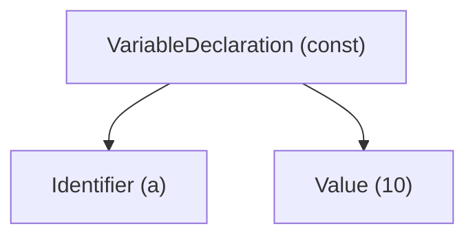

2.  Once the AST is built, V8's interpreter, named **Ignition**, gets to work. Ignition walks the AST and generates **bytecode**. Bytecode is a low-level, platform-independent set of instructions. It's not machine code yet, but it's much closer to the metal than raw JavaScript. For example, an addition operation `a + b` might become bytecode instructions like `Ldar a` (load accumulator with value of `a`), `Add b` (add value of `b` to accumulator). Ignition can then execute this bytecode directly. For code that only runs once, this is often the beginning and end of the story. It's faster than a naive interpreter because it doesn't have to re-parse the source code every time.

3.  While Ignition is executing bytecode, it's also collecting profiling data. It's watching your code run. How many times is this function called? What types of values are being passed to it? What object shapes are being used? This feedback is crucial for the next step. It's like a scout reporting back from the front lines, telling the generals where to focus their efforts.

4.  When Ignition's profiler identifies a piece of code as "hot" (i.e., it's being executed frequently), it gets handed off to **TurboFan**, the optimizing compiler. TurboFan takes the bytecode from Ignition and the profiling feedback and makes a series of _speculative optimizations_. It says, "Okay, this function has been called 1000 times, and every single time the argument `x` was a number. I'm going to bet it will _always_ be a number." Based on this bet, it generates highly optimized, low-level machine code specific to that assumption. This machine code can bypass many of the checks and overhead of the interpreter, leading to massive speedups.

5.  What happens if TurboFan's bet was wrong? What if, on the 1001st call, you pass a string to that function instead of a number? V8 detects this assumption violation, immediately discards the optimized machine code, and seamlessly transitions execution back to the slower Ignition bytecode. This is called **deoptimization**. It ensures correctness, but it comes at a performance cost. If it happens repeatedly, your application will be stuck in a deadly loop of optimizing and deoptimizing, destroying your performance.

Let's demolish a common myth right here.

### Myth 1: "V8 is just an interpreter"

This is fundamentally untrue. While it _has_ an interpreter (Ignition), its main goal is to get to optimized machine code. The bytecode Ignition produces is an implementation detail, a stepping stone to TurboFan.

Here's a simple diagram of the process:

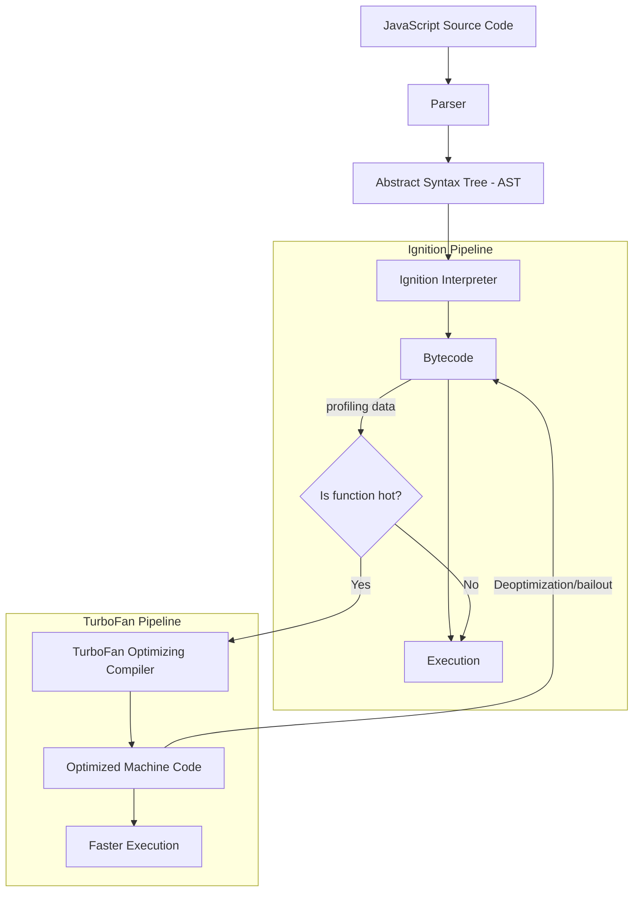

This pipeline is the heart of V8. Your job as a performance-conscious engineer is to write code that flows smoothly down to TurboFan and _stays there_. Every time your code causes a deoptimization, you're forcing V8 to climb back up to a slower tier, and the performance penalty can be staggering.

---

## The Compilation Pipeline: Ignition to TurboFan

Let's zoom in on that pipeline. Understanding the handoff between Ignition and TurboFan is critical because it's where all the performance magic - and all the performance cliffs - happen.

It all starts after parsing. The AST is now in memory.

### Ignition's Role: Baseline Performance

Ignition's primary job is to get your code running _quickly_. Full-blown optimization is a heavy process; it consumes CPU and memory. For code that might only run once during application startup, it would be wasteful to spin up a massive compiler.

So, Ignition walks the AST and emits bytecode. This is a one-to-one process; there's no complex optimization happening here. The design of this bytecode is fascinating. It's a register-based machine rather than a stack-based one, which reduces the number of instructions needed and aligns better with the architecture of real CPUs.

While executing this bytecode, Ignition gathers feedback. The main piece of data it collects is called **Type Feedback**. For every operation in your code (like property access `obj.x`, or an addition `a + b`), V8 creates a **Feedback Vector** slot. As the code runs, Ignition populates this vector with observed types.

For example, for the code `function add(a, b) { return a + b; }`:

- Ignition sees `add(1, 2)`. It records in the feedback vector: "Saw `a` as Small Integer, `b` as Small Integer, operation resulted in Small Integer."
- It sees `add(10, 20)`. The feedback is consistent.
- The function is called 100 times with integers. The feedback vector is now very confident about the types involved.

This feedback is the fuel for TurboFan. Without it, TurboFan is flying blind.

### Sparkplug

Modern V8 actually has a three-tier compilation pipeline. **Sparkplug** is a baseline compiler introduced in 2021 that fills the gap between Ignition and TurboFan. It takes Ignition's bytecode and compiles it directly to machine code without any optimizations. This is faster than interpreting bytecode but doesn't have the overhead of TurboFan's analysis. Sparkplug smooths out the performance cliff between interpreted and optimized code.

Here's the modern three-tier compilation pipeline:

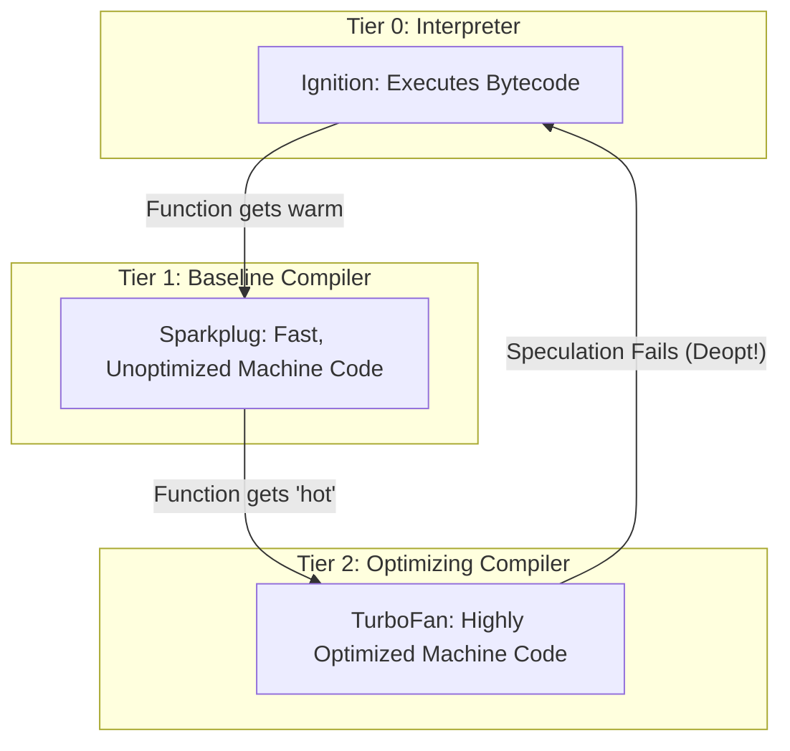

### TurboFan's Trigger: The Hotness Counter

How does V8 decide when to optimize? It uses a simple counter. Every time a function is executed, V8 might increment its hotness counter. When this counter reaches a certain threshold, V8 flags the function for optimization.

This isn't just about the number of calls. The frequency of loops also matters. A loop that runs thousands of times inside a function will quickly make that function "hot."

Once flagged, the **compilation job** is sent to a background thread. This is important: V8 doesn't block your main application thread to compile your code. It does the heavy lifting in parallel, ensuring your app remains responsive.

### TurboFan's speculative optimization

TurboFan now has two things: the **bytecode from Ignition** and the **rich Type Feedback**. It begins its work, which is a masterclass in speculation.

TurboFan doesn't work with bytecode directly. It converts it into an internal graph representation called a "**sea of nodes.**" This graph makes it easier to apply advanced compiler optimizations like redundant/dead code elimination, [constant folding](https://en.wikipedia.org/wiki/Constant_folding), and [loop unrolling](https://en.wikipedia.org/wiki/Loop_unrolling).

TurboFan looks at the feedback vector and makes its bets. "The feedback for `obj.x` says it has always seen the same object shape. I will generate machine code that assumes this shape." This means instead of a generic "look up property `x` on this object" operation (which involves a hash map lookup), it can generate a direct memory access: `mov rax, [rbx + 0x18]`. This is the difference between a slow, multi-step process and a single, blazing-fast CPU instruction.

> [!NOTE]
>
> Don't worry if you havne't seen assembly code before. This instruction is a direct command to fetch data from a precise memory location. It calculates the address using the object's location (rbx) plus a fixed offset (+ 0x18), completely skipping a slow property lookup.

If a hot function `foo()` calls another function `bar()`, TurboFan might decide to **inline** `bar()`. It essentially copies the machine code for `bar()` directly into the code for `foo()`, eliminating the overhead of a function call. This is one of the most powerful optimizations V8 performs.

What if a function is already running when it becomes hot? Imagine a long-running `for` loop. The function was called once, but the loop has been spinning for millions of iterations. V8 can't wait for the function to return to swap in the optimized code. This is where **On-Stack Replacement** (OSR) comes in. While the loop is running in slow Ignition bytecode, TurboFan compiles an optimized version in the background. Once it's ready, V8 can pause execution _in the middle of the loop_, replace the execution frame on the stack with the new optimized frame, and resume execution in the fast machine code.

What you get from TurboFan is a block of machine code that’s been highly optimized based on the behavior Ignition observed. This code is extremely fast, but there's a catch: it's totally dependent on those early observations holding true.

## Hidden Classes

**This is it**. If you only learn one thing about V8 internals, make it this. **Hidden Classes** (also called "Shapes" or "Maps" in V8's source code) are the mechanism V8 uses to implement fast property access on JavaScript objects. They are the foundation upon which TurboFan builds its optimizations.

Let's bust another myth.

### Myth 2: "JavaScript objects are like hash maps"

In your mind, you probably picture a JavaScript object as a dictionary or a hash map, where property names map to values. While this is the _logical_ model, it's not the physical reality for V8. Hash map lookups are relatively slow. To make property access fast, V8 pretends that JavaScript has classes.

When you create an object, V8 creates a **hidden class** for it behind the scenes. This hidden class stores meta-information about the object's shape, specifically the layout of its properties.

Let's watch it happen.

```javascript
// This code lives in examples/v8/hidden-classes-demo.js

// Run with: node --allow-natives-syntax hidden-classes-demo.js
const obj1 = {};
console.log(%HaveSameMap(obj1, {})); // true. Both share the initial hidden class.

// Adding a property creates a new hidden class and a transition.
obj1.x = 1;

const obj2 = {};
console.log(%HaveSameMap(obj1, obj2)); // false. obj1's hidden class has changed.

obj2.x = 5;
// Now obj2 has followed the same transition path as obj1.
console.log(%HaveSameMap(obj1, obj2)); // true. They now share the same hidden class again.
```

> [!CAUTION]
>
> V8 intrinsics (like `%HaveSameMap`) are internal, unsupported APIs that change between V8 versions. Use them only for experiments with `--allow-natives-syntax`. Never use in production code.

### Transition Trees

V8 doesn't just create a new hidden class for every possible object shape. It creates **transition chains**.

When you create `const p1 = {}`, `p1` gets a base hidden class, let's call it `C0`.

When you add `p1.x = 5`, V8 checks if a transition for property `x` already exists from `C0`. If not, it creates a new hidden class `C1` and records a transition: `C0 + 'x' => C1`. The hidden class `C1` now knows that objects with its shape have a property `x` at a specific offset in memory. `p1`'s hidden class is updated to `C1`.

When you add `p1.y = 10`, it does the same thing: it creates `C2` and a transition: `C1 + 'y' => C2`.

Now, if you create another object, `const p2 = {}`, it starts at `C0`. If you then add `p2.x = 15`, V8 sees the existing transition and simply moves `p2` to hidden class `C1`. If you then add `p2.y = 20`, it moves to `C2`. Now, `p1` and `p2` have the _exact same hidden class_. V8 can optimize any code that operates on these objects because it knows they have the same memory layout.

Here’s the killer. What if you create `const p3 = {}` and add the properties in a different order?
`p3.y = 1;`
`p3.x = 2;`

This creates a completely different transition path!
`C0 + 'y' => C3`
`C3 + 'x' => C4`

Even though `p2` and `p3` have the same properties, they have **different hidden classes**. To V8, they are fundamentally different shapes.

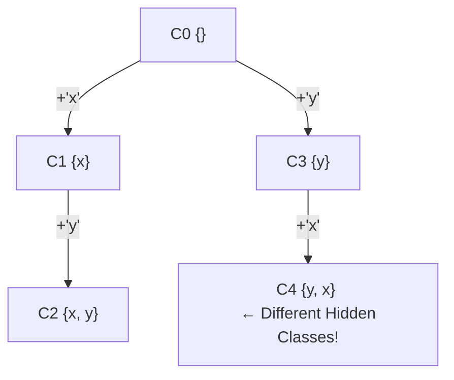

### The "Config Object" disaster we had

This is exactly what killed us in the 100x slowdown mystery. Our code looked something like this:

```javascript
function createConfig(base, userOverrides, requestParams) {
  let config = { ...base }; // Start with a consistent shape

  // User overrides could have any number of properties in any order
  for (const key in userOverrides) {
    config[key] = userOverrides[key];
  }

  // This was the killer: a conditional property
  if (requestParams.useNewFeature) {
    config.optionalFeature = true; // This addition forks the hidden class tree
  }

  return config;
}
```

Because `userOverrides` added keys in an unpredictable order and `optionalFeature` was only sometimes present, we were creating dozens, sometimes hundreds, of different hidden classes for objects that were logically the same. When TurboFan tried to optimize functions that used these `config` objects, it saw chaos. It couldn't make any reliable bets, so it just gave up. Or worse, it would optimize for one shape, then immediately deoptimize when it saw another.

Here's how the hidden class fork happened in our config object:

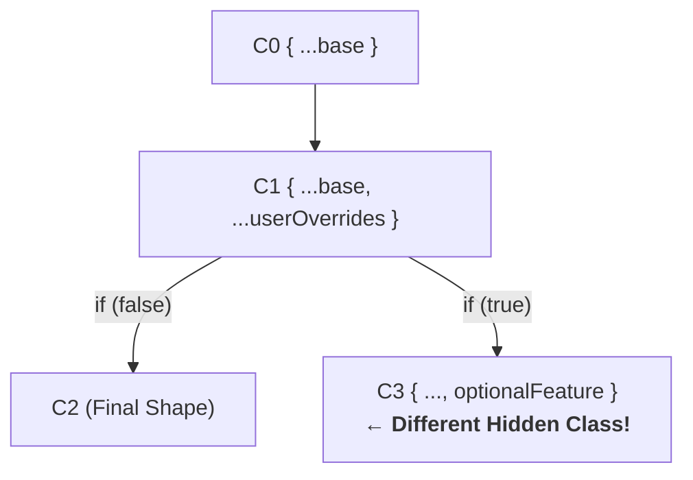

The fix was deceptively simple for our hot-path config objects: **pre-initialize properties that are frequently accessed**, even with `null` or `undefined`.

```javascript
function createConfigV2(base, userOverrides, requestParams) {
  // Initialize a stable, predictable shape. All possible keys are present.
  let config = {
    ...base,
    settingA: null,
    settingB: null,
    optionalFeature: false, // Always present!
  };

  // Now, we are just *updating* properties, not adding them.
  // This does not change the hidden class.
  for (const key in userOverrides) {
    if (key in config) {
      config[key] = userOverrides[key];
    }
  }

  if (requestParams.useNewFeature) {
    config.optionalFeature = true;
  }

  return config;
}
```

By creating a stable initial shape, we ensured that almost all our config objects shared the same hidden class. This allowed TurboFan to generate highly optimized code for handling them, and our latency dropped from 200ms back down to 2ms. We learned a brutal lesson: **property addition order is not just a stylistic choice, it's a critical performance determinant**.

> [!CAUTION]
>
> Pre-initializing all properties stabilizes shapes but can waste memory with large objects. Only do this for performance-critical objects on hot paths. For general-purpose objects, favor readability and maintainability.

## Inline Caching and Monomorphism

So, V8 uses **Hidden Classes** to create a secret blueprint for your objects. That's the "what." Now for the "how": how does V8 actually _use_ that blueprint to make your code scream? The answer is a brilliant piece of runtime optimization called an **Inline Cache (IC)**. This is the mechanism that connects the theory of Hidden Classes to real-world speed.

First, let's nail down a key piece of jargon: the **call site**. A call site isn't some abstract idea; it's a literal, physical place in your code where a dynamic operation happens.

```javascript
function getX(point) {
  return point.x; // <-- THIS is the call site for the '.x' property access.
}

getX({ x: 10, y: 20 }); // Execution hits the call site inside getX
getX({ x: 30, y: 40 }); // Execution hits the SAME call site again
```

The line `return point.x;` is a single, unique call site. No matter what object you pass to `getX`, V8 is always executing that _same line_ to access the `x` property. This specific location is what V8 optimizes.

Think of an IC as targeted muscle memory. The first time you access `obj.x` at a particular call site, V8 has to do the slow, painful lookup:

1.  Get the hidden class of `obj`.
2.  Scan that hidden class's metadata for the memory offset of property `x`.
3.  Jump to that offset in the object's memory and get the value.

After doing all that work, V8 doesn't just forget. It rewrites a tiny stub of machine code at that exact call site. This stub is the Inline Cache. The next time that line of code is executed, the IC does a single, super-fast check: **"Is the hidden class of this new object the same as the one I saw last time?"** If the answer is yes, it completely skips the slow lookup and uses the cached offset to access the property directly. A dynamic lookup just became as fast as a direct memory access in C++. This is a massive win.

This brings us to the different "modes" or states an IC can be in. This is where the terminology gets important:

1.  **Uninitialized -** The IC is a clean slate before the first execution of that line of code.
2.  **Monomorphic -** This is the golden state. The IC has only ever seen **one** hidden class at this call site. `Mono` means one. This is the fastest possible state because V8 can generate machine code that is hyper-specialized for this single shape.
3.  **Polymorphic -** The IC has seen a small number of different hidden classes (typically 2 to 4). `Poly` means many. V8 can still handle this, but it's slower. It has to add checks: "Is it shape A? If so, use offset X. Is it shape B? If so, use offset Y?" This is still faster than a full dynamic lookup.
4.  **Megamorphic -** The IC has seen too many different hidden classes. `Mega` means huge. At this point, V8 gives up. The IC is considered "polluted," and V8 falls back to the slow, generic lookup. Performance goes off a cliff.

Here’s how an IC transitions through these states -

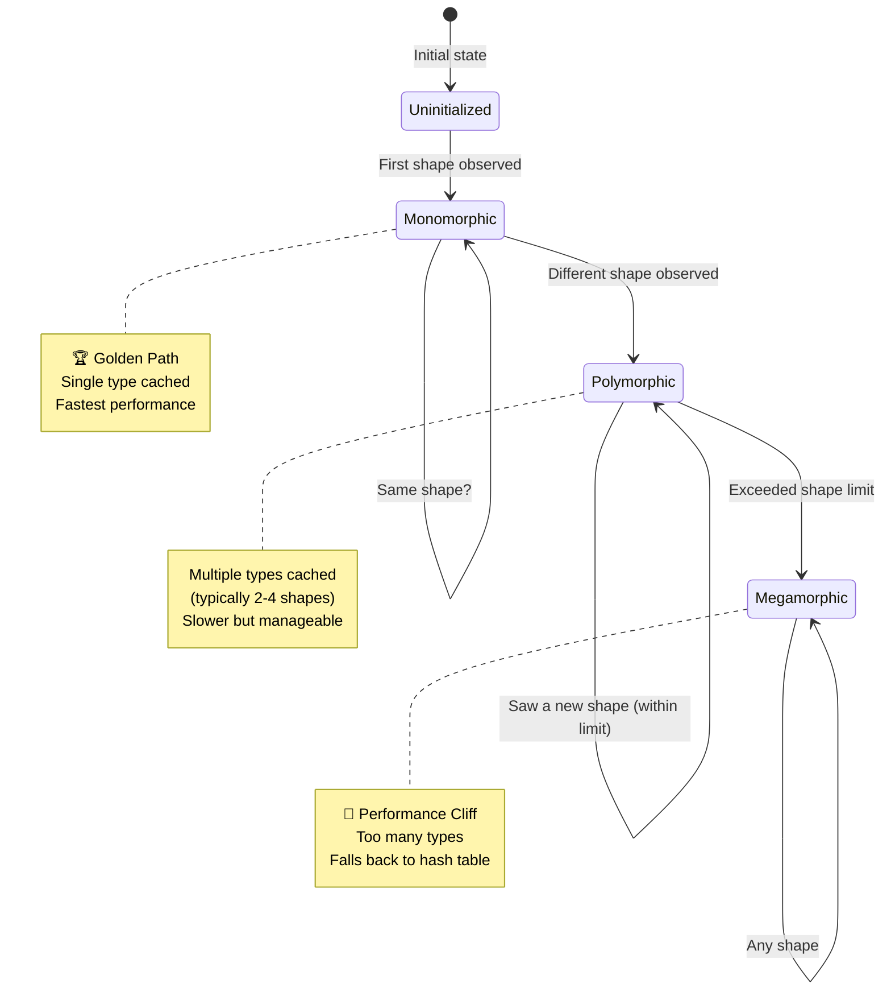

When the IC is polymorphic, it's essentially running a series of checks like this internally -

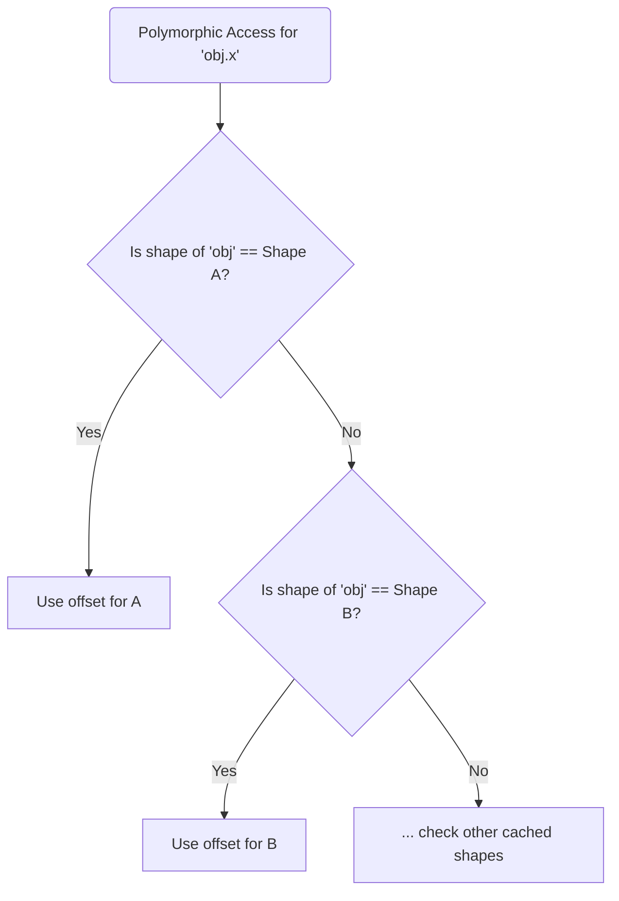

### A small example

Talk is cheap. Let's see what this performance difference actually looks like with a real benchmark. This pattern is incredibly common in data processing.

```javascript
// This code lives in examples/v8/monomorphic-patterns.js
// Run with: node --allow-natives-syntax monomorphic-patterns.js

const ITERATIONS = 10000000;

class Point2D {
  constructor(x, y) {
    this.x = x;
    this.y = y;
  }
}

class Point3D {
  constructor(x, y, z) {
    this.x = x;
    this.y = y;
    this.z = z;
  }
}

// This function's call site is MONOMORPHIC. It will always see Point2D objects.
// V8 will heavily optimize this.
function getX_Monomorphic(point) {
  return point.x;
}

// This function's call site is POLYMORPHIC. It will see two different shapes.
// V8 can handle this, but it's slower.
function getX_Polymorphic(point) {
  return point.x;
}

// ========= BENCHMARK =============

// Prime the functions so V8 can optimize them
for (let i = 0; i < 1000; i++) {
  getX_Monomorphic(new Point2D(i, i));
  // Pass both shapes to the polymorphic function
  getX_Polymorphic(new Point2D(i, i));
  getX_Polymorphic(new Point3D(i, i, i));
}

console.time("Monomorphic");
let mono_sum = 0;
for (let i = 0; i < ITERATIONS; i++) {
  mono_sum += getX_Monomorphic(new Point2D(i, i));
}
console.timeEnd("Monomorphic");

console.time("Polymorphic");
let poly_sum = 0;
for (let i = 0; i < ITERATIONS; i++) {
  // Alternate between the two shapes
  const point = i % 2 === 0 ? new Point2D(i, i) : new Point3D(i, i, i);
  poly_sum += getX_Polymorphic(point);
}
console.timeEnd("Polymorphic");

// Note: Ensure sums are used to prevent V8 from optimizing away the loops.
console.log(mono_sum, poly_sum);
```

On my machine running Node.js v23, the results are obvious (your results may vary):
`Monomorphic: 16.05ms`
`Polymorphic: 47.23ms`

The polymorphic version is nearly **3x slower**. And that's with only _two_ shapes. Imagine a function that receives objects from five different sources, each with a slightly different structure. That call site will become megamorphic, and the performance penalty could easily be 10-50x.

The goal is to write functions that operate on predictable data structures. When you see a function that can receive "either a User object or a Company object," your performance senses should be tingling. It might be better to have two separate, monomorphic functions: `processUser(user)` and `processCompany(company)`. Boring, repetitive code is often the fastest code.

## Deoptimization - When V8 Gives Up

Deoptimization is V8's emergency eject button. It's the process of throwing away fast, optimized machine code and falling back to the slow-but-safe bytecode interpreter. It is, without a doubt, the single biggest cause of mysterious performance problems in Node.js applications.

Remember, TurboFan's machine code is _speculative_. It's built on a pile of assumptions (type feedback) gathered by Ignition. Deoptimization occurs whenever one of those assumptions is proven false at runtime.

### Common Deoptimization Triggers

V8 will deoptimize for many reasons, but some culprits are far more common than others.

1.  **Hidden Class Mismatch -** This is the big one. TurboFan compiled a function assuming it would always see objects with hidden class `C2`. Suddenly, an object with `C4` arrives. The specialized machine code is now invalid. **Bailout!**

2.  **Changing Array Element Kinds -** V8 tracks the "kind" of elements in an array. Is it all small integers? All doubles? All objects? It optimizes based on this. If you have an array `[1, 2, 3]` (packed small integers, the fastest kind) and you suddenly push a string `arr.push('a')`, you've forced a storage transition. V8 dynamically upgrades the array to handle the new element type, and any optimized code that assumed an integer array may need to deoptimize. Not all transitions cause persistent slowdowns - V8 handles many efficiently - but in hot loops with large arrays, these transitions can impact performance.

3.  **`try...catch` Blocks (Historical Issue) -** This was problematic in older V8 versions, where the machinery needed to handle exceptions could interfere with TurboFan's optimizations. Modern V8 (Node v16+) has largely resolved this issue. In current Node versions (v22-24), `try...catch` has minimal performance impact in most cases. Use error handling freely for correctness – the old advice to avoid `try...catch` is outdated.

> [!TIP]
>
> Modern V8 (Node 16+) optimizes `try...catch` blocks reasonably well. Use them freely for correctness; only profile before considering refactoring out of extreme hot paths.

4.  **Using `arguments` Object -** The `arguments` object is a classic deoptimizer. It's an "array-like" object, but it's not a true array and has some magic properties that make it difficult for compilers to reason about. Using it, especially in older versions of Node, was a guaranteed way to kill performance. Modern V8 is better, but a function that leaks `arguments` can still be problematic. Rest parameters (`...args`) are almost always a better, optimization-friendly choice.

5.  **The `delete` Keyword -** While V8 has improved its handling of `delete` over the years, it still degrades performance on hot objects. Using `delete obj.x` can force V8 to switch the object into "dictionary mode," where properties are stored in a slower hash map-like structure. If you only need to clear a value on a hot path, use `obj.x = undefined`. However, if you need the property truly gone for correctness (e.g., for key enumeration or the `in` operator), `delete` remains the right choice – just avoid it in performance-critical paths.

> [!IMPORTANT]
>
> Avoid `delete` on hot objects, but remember that setting to `undefined` is not semantically equivalent. Properties set to `undefined` still exist for `Object.keys()`, `in` operator, and iteration.

### Caught Off Guard by BigInt Deoptimization

We were running a high-performance transaction simulation service for our trading platform. It monitored the mempool, simulating thousands of transactions per second to front-run profitable opportunities. The service would fire up, blazing fast, but over the course of an hour, its simulated TPS would drop off a cliff until it was missing every arbitrage window. A restart was the only cure, but the relief was temporary.

We were burning our heads against the wall. Finally, we attached the V8 inspector with some flags: `node --trace-opt --trace-deopt simulator.js`. The logs were a torrential downpour of data, but one line screamed at us, repeated thousands of times:

`[deoptimizing: begin 0x... <validateTransaction> (opt #3) at bytecode offset 68, reason=unexpected BigInt]`

The `validateTransaction` function - our hottest code path - was being beautifully optimized by TurboFan, only to be immediately thrown out. Over and over. A quick look at the code corresponding to that bytecode offset pointed to a line where we were calculating potential [slippage](<https://en.wikipedia.org/wiki/Slippage_(finance)>) on a token swap amount.

The problem? The vast majority of transactions we processed - standard ETH transfers, small DEX swaps - had values that fit neatly into a standard JavaScript `Number`. But every so often, a whale would move a massive amount of a high-decimal token (think SHIB). Those values are so large they can **only** be represented as a `BigInt`.

TurboFan had seen millions of `Number` types and bet the farm on it. It generated hyper-optimized machine code for fast, floating-point arithmetic. When the `BigInt` showed up, the JIT's worldview shattered. **Bailout!** The function deoptimized. A few thousand transactions later, V8 would try again, re-optimizing for `Number`. Then another whale transfer would hit. Lather, rinse, repeat.

This is the "Deoptimization Loop of Death" in the wild:

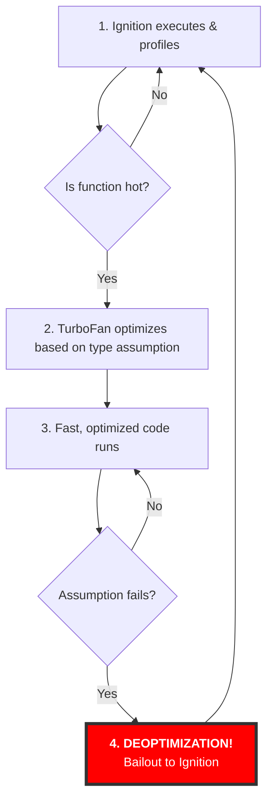

---

#### The Fix: Enforcing Type Consistency

Our first instinct was to normalize the data. We knew we couldn't just convert everything to `BigInt` and keep our floating-point math, as that would immediately throw a `TypeError`.

```javascript
// This is what you CAN'T do
const value = BigInt(rawTx.value); // e.g., 100000000000000000000n
const slippage = value * 0.005; // THROWS: TypeError: Cannot mix BigInt and other types
```

The solution had to be holistic. We chose to enforce absolute type consistency by treating all monetary values as scaled integers from the moment they entered our system. This is a common pattern in finance to avoid floating-point inaccuracies anyway.

**Our Fix: Normalize to BigInt and Use Scaled Integer Math**

We represented our slippage constant in basis points (1 basis point = 0.01%) as a `BigInt` and performed all calculations using `BigInt` arithmetic.

```javascript
// Represent slippage in basis points (bps) as a BigInt
const MAX_SLIPPAGE_BPS = 50n; // 50bps = 0.50%

// The ingestion function now normalizes everything to BigInt
function handleRawTx(rawTx) {
  const tx = {
    ...rawTx,
    value: BigInt(rawTx.value),
  };
  return validateTransaction(tx);
}

// The hot function is now 100% BigInt-safe and type-stable
function validateTransaction(tx) {
  // tx.value is always a BigInt
  const slippage = (tx.value * MAX_SLIPPAGE_BPS) / 10000n;
  // ... rest of BigInt-only logic
  return isProfitable;
}
```

This solved the deoptimization loop completely. TurboFan now only ever saw `BigInt`s in this function and generated stable, optimized code for that specific type.

##### Trade-offs and Alternative Fixes

While our scaled-integer approach worked, it's not the only solution, and it comes with a trade-off: **`BigInt`** arithmetic is generally slower than `Number` arithmetic for values that fit within a standard **number**. We were potentially slowing down 99.9% of our transactions to safely handle the 0.1% of whale transfers.

For our specific use case, stability was worth the trade-off. However, here are two other powerful, practical patterns for solving this problem.

##### The Dispatcher - What we decided to use

This is what was - according to our team - the highest-performance solution, we could think of. The idea is to have two separate, specialized hot functions and a single "dispatcher" that routes transactions to the correct one. This keeps each hot path **monomorphic** (only ever seeing one type), which is exactly what the JIT loves.

```javascript
function handleRawTx(rawTx) {
  const val = BigInt(rawTx.value);

  // Dispatch to the correct specialized function at the boundary
  if (val <= BigInt(Number.MAX_SAFE_INTEGER)) {
    const tx = { ...rawTx, value: Number(val) };
    return validateTransactionNumber(tx); // Fast path for most transactions
  } else {
    const tx = { ...rawTx, value: val };
    return validateTransactionBigInt(tx); // Path for whale transactions
  }
}

function validateTransactionNumber(tx) {
  // Hot Function #1
  const slippage = tx.value * 0.005; // Fast, floating-point math
  // ...
}

function validateTransactionBigInt(tx) {
  // Hot Function #2
  const slippage = (tx.value * 50n) / 10000n; // BigInt math
  // ...
}
```

###### Alternative B: The Guarded Branch (Pragmatic Middle Ground)

If you want to keep your logic in a single function, you can use an explicit `typeof` check. This creates two different paths within the same function. While this makes the function **polymorphic** (seeing multiple types), it’s a clear signal to V8 and is often optimized well - certainly better than incurring repeated deopts.

```javascript
function validateTransaction(tx) {
  if (typeof tx.value === "bigint") {
    // BigInt branch
    const slippage = (tx.value * 50n) / 10000n;
    // ...
  } else {
    // Number branch
    const slippage = tx.value * 0.005;
    // ...
  }
}
```

> [!WARNING]
>
> A single function that contains both a bigint path and a number path (via typeof checks) is polymorphic. That’s often fine - but in very hot loops it can make V8 generate slower, less-stable machine code than splitting those paths into two monomorphic functions and dispatching once up-front. Pick the dispatcher for raw performance in the hot path; pick the guarded-branch for simplicity when the branch is predictable or the path isn’t super hot.

## Memory Layout and Object Representation

To truly understand V8 performance, you have to go one level deeper and think about how your JavaScript values are actually laid out in your computer's memory. This isn't just academic; it has direct performance implications.

V8 uses a clever trick called pointer tagging to distinguish between immediate values (like small integers) and pointers to objects on the heap. While a 64-bit system uses 64-bit machine words, V8's default pointer compression optimization means that these tagged values are often stored in compact 32-bit slots on the heap to save memory.

### Small Integers (SMI)

If the last bit of a 64-bit word is a `0`, V8 knows the remaining bits represent a **Small Integer**, or **Smi**. This is an incredibly important optimization. On 64-bit builds with pointer compression (the default), Smis are 31-bit signed integers, giving a range of approximately -1 billion to +1 billion. V8 doesn't need to allocate any extra memory on the heap for these values. The number _is_ the pointer.

> [!NOTE]
>
> On 64-bit builds with pointer compression, Smis are 31-bit signed integers. On 32-bit builds, the range is slightly different. Always assume ~±1 billion as the safe range, not full 32-bit.

Arithmetic on Smis is lightning fast. The CPU's integer arithmetic logic unit (ALU) can operate on them directly. This is why `for` loops with integer counters are so much faster than loops dealing with floating-point numbers or objects.

A 64-bit word representing a Smi (e.g., the number 5):

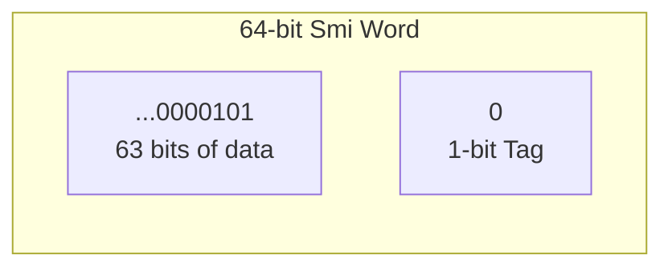

### Heap Objects

So, what happens when that special tag bit is a `1`? This signals that the word isn't the value itself, but a **pointer** - a memory address that references the actual data's location on the V8 heap.

This is how V8 handles all the complex data that can't be represented as a Smi: from strings and arrays to objects, and even numbers with decimal points.

To keep its memory usage low, V8 uses a fantastic optimization by default called **pointer compression**. This means that even on a 64-bit system, these pointers are often stored in compact **32-bit** slots.

Here’s a simplified look at a tagged pointer in V8's memory-saving mode:

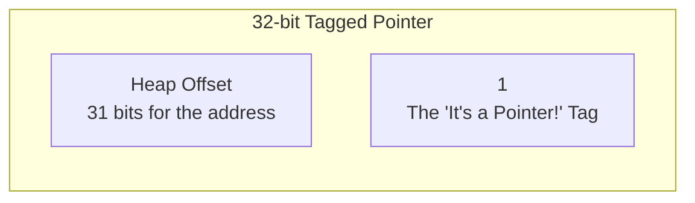

Let's take a number like `const a = 3.14;`. In the classic sense, V8 would handle this by creating a `HeapNumber` object, which involves a few steps -

1.  First, it allocates a small chunk of memory on the heap.
2.  Then, it writes the floating-point representation of `3.14` into that memory.
3.  Finally, it stores a tagged pointer to that new location in the variable `a`.

But this is where the story gets exciting. The V8 team has spent years optimizing this process, and modern V8 has some amazing tricks up its sleeve to avoid that heap trip for frequently executed code -

- **Unboxing -** V8 can store a number's raw value directly inside another object's memory, avoiding the need to allocate a separate `HeapNumber` object.
- **Escape Analysis -** If a number is created and used only within a single function and never "escapes" to an outer scope, V8 is smart enough to avoid heap allocation altogether.

So, while there's a performance cost when heap allocation _does_ occur (it requires managing memory and following pointers), all thanks to V8’s incredible engineering that this happens far less often than you might think.

### Object Layout in Memory

When an object is created, V8 allocates memory for it on the heap. This memory block contains 1) a pointer to its **hidden class**. This is the first and most important field and 2) space for its properties.

For objects with "fast properties" (i.e., not in dictionary mode), the properties are stored directly inside the object's memory block at fixed offsets determined by the hidden class.

Let's imagine our `Point` object: `const p = { x: 1, y: 2 }`. Its memory might look like this -

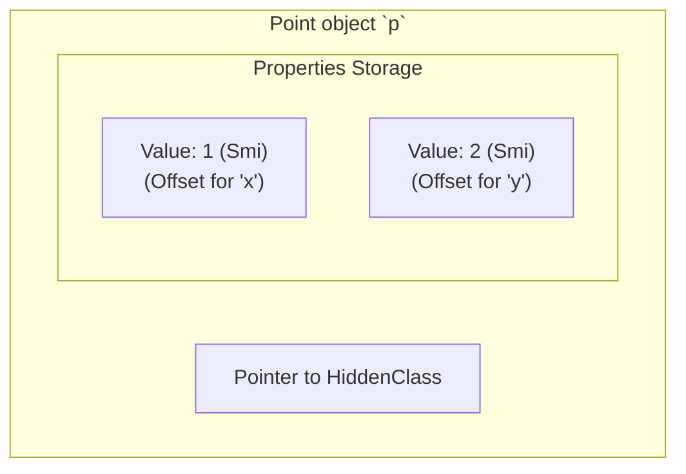

When TurboFan optimizes `p.y`, it gets the hidden class from `p`, sees it's `C2`, knows from `C2` that `y` is at offset +8 bytes (for example), and generates machine code to just read the memory at `[address of p + 8]`. No hash map lookups. No string comparisons. Just raw, fast memory access.

### String Internalization

Strings are another area with a clever optimization. When you have the same string literal multiple times in your code, like `'success'`, V8 only stores it in memory once. This is called **string internalization** or "interning." All variables pointing to that string literal will point to the same memory address. This saves memory and makes string comparisons much faster: V8 can just compare the pointers (a single CPU instruction) instead of comparing the strings character by character.

Here's how string internalization works in memory:

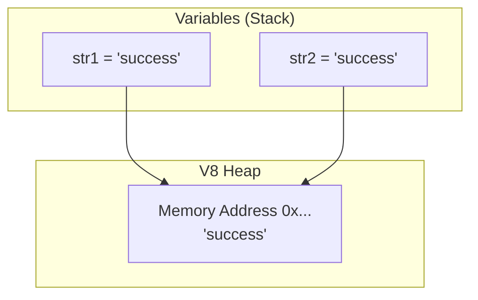

Understanding this memory model helps explain many V8 performance characteristics -

1. **Why integer math is fast?** Smis avoid heap allocation and indirection.
2. **Why hidden classes are key?** They enable fixed-offset property access.
3. **Why `delete` is slow?** It forces a change from this clean, array-like property storage to a complex, slow dictionary-based one.

## Common Performance Cliffs

After seeing hundreds of production performance issues, you start to see the same patterns over and over. These are the common cliffs that developers, even senior ones, fall off when they don't understand the engine.

### Cliff #1: Unstable Object Shapes (Hidden Class Explosions)

This is the big one we saw in our recent discussion. Any code that creates objects with different property orders, different total properties, or conditional properties is a minefield.

- **Symptom -** Code that processes objects is mysteriously slow. Flame graphs are wide and flat, with no single hot function.
- **Cause?** Megamorphic inline caches due to an explosion of hidden classes.
  ```javascript
  // Bad code
  const user = { name: "Alice" };
  if (isAdmin) {
    user.permissions = ["..."];
  }
  // `user` now has two possible shapes.
  ```
  ```javascript
  // Good code!
  const user = {
    name: "Alice",
    permissions: null, // or `undefined` - always initialize
  };
  if (isAdmin) {
    user.permissions = ["..."];
  }
  // `user` has one stable shape.
  ```

### Cliff #2: Polymorphic and Megamorphic Functions

Functions that are designed to handle many different types of inputs are an enemy of the JIT compiler.

- **Symptom -** A specific utility function or event handler is a bottleneck.
- **Cause?** An IC at a property access or function call site has become polymorphic or megamorphic.
  ```javascript
  // Bad code
  function getIdentifier(entity) {
    // This function might get a User, a Product, a Company...
    return entity.id || entity.uuid || entity.productId;
  }
  ```
  ```javascript
  // Better!
  // Create separate, monomorphic functions.
  function getUserId(user) {
    return user.id;
  }
  function getProductIdentifier(product) {
    return product.productId;
  }
  ```

### Cliff #3: Using `delete` on Objects

We built a simple in-memory caching layer for our Node.js service. It was just a big JavaScript object. When an item expired, we'd remove it from the cache using `delete cache[key]`. Simple, right? I've also posted about this on [Reddit](https://www.reddit.com/r/webdev/comments/1n23rbi/i_stopped_deleting_and_my_hot_paths_calmed_down/) in case you're interested.

The service throughput was disappointing, about 35-40% of what we expected. Profiling showed a huge amount of time being spent inside property access functions for the cache object. The flame graph was dominated by dictionary lookups and megamorphic inline cache misses.

The problem was `delete`. When you use `delete`, you are not just removing a property. You are fundamentally changing the object's structure in a way that V8 cannot optimize with a simple hidden class transition. Using `delete` forces V8 to switch the object's properties into **Dictionary Mode**. In this mode, the properties are stored in a slower, hash map-like data structure. Every single property access on that object, _even for keys you didn't delete_, now becomes a slow dictionary lookup. Our entire cache object was kneecapped.

The fix? **Never use `delete` on hot objects.** Instead, set the property to `undefined`.

```javascript
// This code lives in examples/v8/performance-cliffs.js

const cache = {};

function setCache(key, value) {
  cache[key] = value;
}

// The performance killer
function evictWithDelete(key) {
  delete cache[key]; // This poisons the cache object.
}

// The performant way
function evictWithUndefined(key) {
  cache[key] = undefined; // The hidden class remains stable.
}
```

Assigning `undefined` preserves the hidden class and keeps the object in "fast mode." Our throughput instantly jumped by 3-4x after we replaced all `delete` calls with assignments to `undefined`.

### Cliff #4: Mixing Element Kinds in Arrays

V8 optimizes arrays heavily based on their contents and dynamically upgrades between element kinds:

- `PACKED_SMI_ELEMENTS` - The fastest. A contiguous block of memory holding only small integers.
- `PACKED_DOUBLE_ELEMENTS` - Still fast. A contiguous block of doubles.
- `PACKED_ELEMENTS` - A contiguous block of pointers to heap objects.
- `HOLEY_ELEMENTS` - An array with empty slots (e.g., `const a = [1, , 3]`). Slower, because V8 has to check for holes.
- `DICTIONARY_ELEMENTS` - The slowest. The array is basically a hash map.

If you start with `[1, 2, 3]` and then `push('hello')`, V8 has to convert the entire underlying storage from `PACKED_SMI_ELEMENTS` to `PACKED_ELEMENTS`. This transition is one-way and affects performance primarily in hot loops where the array is accessed repeatedly. For most everyday array usage, V8 handles these transitions efficiently, but in performance-critical numeric computations or when processing large datasets, maintaining stable element kinds can provide significant benefits.

> [!IMPORTANT]
>
> Mixing element kinds forces storage transitions, which can hurt performance in hot loops. For most everyday use, the impact is negligible, but in tight numeric loops or large datasets, stable element kinds matter.

## Patterns that work

So how do we stay in V8's good graces? By writing boring, predictable, monomorphic code. It might feel less "clever," but it will be orders of magnitude faster.

### The V8-Friendly Code Pattern

Here's a blueprint for a performance-critical data structure and the function that processes it.

```javascript
// This code lives in examples/v8/optimization-triggers.js

// 1. Use a class or a constructor function to define a stable shape.
// This is the most reliable way to ensure all objects share a hidden class.
class DataPacket {
  constructor(id, timestamp, payloadType, payload) {
    // 2. Initialize all properties in the constructor.
    // The order here DEFINES the hidden class. Keep it consistent.
    this.id = id; // Should be a Smi if possible
    this.timestamp = timestamp; // Number
    this.payloadType = payloadType; // String
    this.payload = payload; // Object or null
  }
}

// 3. Keep your processing function MONOMORPHIC.
// It's designed to work ONLY with DataPacket objects.
// Use types (e.g., TypeScript) to enforce this at the boundary.
function processPacket(packet) {
  // 4. Access properties consistently. This keeps ICs warm and monomorphic.
  const id = packet.id;
  const type = packet.payloadType;

  // 5. Prefer Smi-friendly arithmetic in hot loops.
  // Bitwise operations are a good sign you're dealing with Smis.
  if ((id & 1) === 0) {
    // Do something for even IDs
  }

  // 6. Avoid deoptimization triggers.
  // No `delete`, no `arguments`, no `try/catch` in the absolute hottest part.
  if (type === "USER_EVENT" && packet.payload) {
    // Process payload
  }
}

// This is how you could use the points mentioned above

const packets = [];
// 7. Create objects with the same shape.
for (let i = 0; i < 1000; i++) {
  packets.push(new DataPacket(i, Date.now(), "USER_EVENT", { data: "..." }));
}

// 8. Run the hot function. V8 will optimize `processPacket`
// based on the stable `DataPacket` shape.
function processAll() {
  for (let i = 0; i < packets.length; i++) {
    processPacket(packets[i]);
  }
}

// 9. Profile and measure!
console.time("Processing");
processAll();
console.timeEnd("Processing");
```

### Optimization Strategy: A Checklist

Before you even think about changing code, follow this process:

1.  Don't guess. Use `--prof` or the Chrome DevTools inspector to find your actual hot paths. Optimizing code that only runs 0.1% of the time is a waste of effort.
2.  Zoom in on the 1-3 functions that consume the most CPU. This is where your focus should be - "identifying the hot paths".
3.  For each hot function, analyze the data it receives. Are the object shapes consistent? Are array element kinds stable? Use `console.log(%HaveSameMap(a, b))` to verify.
4.  Run your hot path in a tight loop with `--trace-deopt` and `grep` for your function's name. Look at the reasons V8 gives for bailing out.
5.  Refactor your code for predictability -
    - Initialize objects with all properties (`null` or `undefined` is fine).
    - Use constructors or factory functions to enforce a single creation path.
    - If a function needs to handle different shapes, split it into multiple, monomorphic functions.
    - Replace `delete` with `obj.prop = undefined`.
    - Avoid mixing element kinds in performance-critical arrays.
6.  After refactoring, run the profiler again. Did the change work? Is the time spent in that function lower?

## V8 Flags and Runtime Options

The Node.js runtime provides a powerful set of V8 flags that let you tune, debug, and exampine the engine's behavior. You can list all available flags for your version of Node with `node --v8-options`. Here are some of the most critical ones for performance engineering.

### Informational Flags

These flags don't change behavior but provide a stream of diagnostic information.

- `--trace-opt`: As mentioned, this logs every function that TurboFan successfully optimizes. It's great for confirming that your hot paths are actually being compiled.
- `--trace-deopt`: Logs every deoptimization, including the function name, bytecode offset, and the reason. This is arguably the most important performance debugging flag.
- `--trace-ic`: Shows the state transitions of Inline Caches. Useful for diagnosing polymorphic and megamorphic call sites. You can see a property access go from `1` (monomorphic) to `P` (polymorphic) to `N` (megamorphic).
- `--trace-gc`: Prints a log line for every garbage collection event, showing how much memory was collected and how long it took. Useful for diagnosing memory pressure and GC pauses.

### Behavioral Flags

These flags can alter how V8 optimizes and executes code. Use with caution.

- `--allow-natives-syntax`: Exposes the `%` functions for scripting V8's internals. Helpfeul for detailed analysis and benchmarking, but never for production.
- `--optimize-for-size`: Asks V8 to be more conservative with optimizations to reduce the memory footprint of compiled code. This can be useful in low-memory environments.
- `--max-old-space-size=<megabytes>`: Sets the maximum size of the old generation heap. Increasing this can reduce GC frequency for memory-intensive applications, but also lead to longer GC pauses when they do occur.
- `--jitless`: This is an interesting one. It completely disables the JIT (TurboFan). Your code will only ever be run by the Ignition interpreter. This provides better security (by preventing runtime code generation) at a significant performance cost. It's useful for establishing a "baseline" performance to see how much TurboFan is actually helping.

### How to Use Flags

You pass these flags to the `node` executable before your script name:
`node --trace-deopt --max-old-space-size=4096 my_app.js`

You can also set them via the `NODE_OPTIONS` environment variable, which is often more convenient for development environments or CI/CD pipelines:
`export NODE_OPTIONS="--trace-deopt --max-old-space-size=4096"`
`node my_app.js`

Knowing how to use these flags is like having a diagnostic toolkit for the engine. When performance goes wrong, you're no longer guessing; you can ask V8 directly what's happening.

## From Full-Codegen to TurboFan

The V8 architecture we've discussed - Ignition and TurboFan - is relatively new. It was fully rolled out around 2017. To appreciate its design, it's helpful to understand what came before it.

For many years, V8's pipeline consisted of two main components -

**Full-Codegen -** A simple, non-optimizing compiler. Its job was to take JavaScript and produce machine code as quickly as possible. It was fast to compile but produced slow machine code. It was the "good enough for now" compiler.

**Crankshaft -** The optimizing compiler. Like TurboFan, Crankshaft would take hot functions and re-compile them into highly optimized machine code. It used a technique called **Static Single Assignment (SSA)** form and had a sophisticated optimization pipeline.

However, this architecture had several problems:

- There was a huge performance gap between the code produced by Full-Codegen and Crankshaft. Your code was either slow or very fast, with little in between.
- Deoptimization (or "bailout" as it was(is) often called) from Crankshaft was a complex and slow process.
- Full-Codegen generated a lot of machine code, and the Crankshaft pipeline itself was memory-intensive.
- The two compilers didn't share much code. Adding new language features often meant implementing them twice, in two different ways.

### The New Pipeline: Ignition and TurboFan

The V8 team undertook a massive project to re-architect the engine from the ground up. This resulted in the modern pipeline -

**Ignition (Interpreter) -** The team realized that for much of the web and Node.js applications, compiling to machine code upfront (even with Full-Codegen) was overkill. An interpreter that generates and runs bytecode would have a much lower memory footprint and faster startup time. This was a key insight: **bytecode is often better than unoptimized machine code**. The memory savings were substantial, especially on mobile devices.

**TurboFan (Compiler) -** TurboFan was designed from the start to be a more advanced and flexible optimizing compiler.

- It has a cleaner architecture based on the "sea of nodes" graph representation.
- It was designed to optimize not just JavaScript, but also WebAssembly and other languages.
- It has a much better-defined "tiering" model. The path from Ignition to TurboFan is smoother, and deoptimization is less catastrophic.
- It can handle constructs like `try...catch` and `with` much more gracefully than Crankshaft ever could.

This new pipeline, introduced in V8 v5.9, provided significant real-world benefits -

- Ignition's bytecode is much more compact than Full-Codegen's machine code, leading to memory savings of 5-10% on real websites.
- Less time is spent compiling code that will never be hot.
- The performance cliff between the baseline and optimized tiers is less steep, and deoptimization is handled more efficiently.

Here's how the architecture evolved -

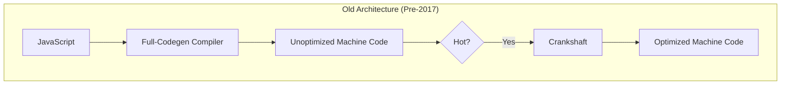

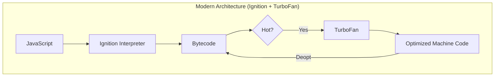

This history demolishes another myth.

### Myth 3: "Modern V8 optimizes everything"

Not even close. V8 doesn't _want_ to optimize everything. Optimization is expensive. The entire design of the modern Ignition/Sparkplug/TurboFan pipeline is based on the idea of **tiered compilation**. It does the absolute minimum work required to get your code running (Ignition) and only spends CPU cycles on optimizing the small percentage of your code that is actually performance-critical. Your job is to make that small percentage of code easy for TurboFan to understand and optimize.

## Best practices for V8 performance

This is the actionable summary. If you're in a performance review and need a checklist, this is it.

**DO's:**

- Use constructors, classes, or factory functions to ensure objects have the same hidden class. Initialize all members, even with `null` or `undefined`.
- Write functions that operate on a single, predictable object shape (monomorphic). If you must handle multiple shapes, consider breaking the function into smaller, monomorpic ones.
- Leverage the fast path for Small Integers (Smis) whenever possible.
- Don't guess where your bottlenecks are. Use `node --prof` or the Chrome Inspector to find them.
- Use `--trace-deopt` to find and fix deoptimization loops.
- Clever, dynamic code is often the enemy of the JIT compiler. Simple, straightforward code is easier for V8 to optimize.

**DON'Ts -**

- Never use `delete` on objects in a hot path. Set properties to `undefined` instead.
- Avoid writing functions where arguments can be one of many different shapes or types.
- Avoid adding properties to objects after they've been created.
- **Don't use the `arguments` object.** Use rest parameters (`...args`) instead. They are fully optimizable.
- **Don't `eval` or use `with` statements.** These are black boxes for the compiler and kill performance.
- **Don't ignore deoptimizations.** A deopt in a hot function is a critical performance bug.

### A checklist you can keep handy

- [ ] Do my critical data objects have consistent, stable shapes?
- [ ] Are my performance-critical functions monomorphic?
- [ ] Have I run `--trace-deopt` on my hot paths to check for optimization bailouts?
- [ ] Have I profiled my application under load to confirm where the bottlenecks are?
- [ ] Is the memory layout of my objects and arrays as efficient as possible (e.g., avoiding holes, using Smis)?
- [ ] Have I measured the "before" and "after" to confirm my optimizations had a positive impact?

## Appendix: V8 profiling commands

A quick reference for the commands you'll use most often.

**Basic CPU Profiling:**

```bash
# 1. Generate the V8 log file
node --prof my_app.js

# 2. Process the log file into a human-readable summary
node --prof-process isolate-XXXX-v8.log > profile.txt
```

**Remote Debugging & Profiling with Chrome DevTools:**

```bash
# Run your app with the inspect flag
node --inspect my_app.js

# Or to break on the first line:
node --inspect-brk my_app.js
```

Then open `chrome://inspect` in your Chrome browser.

**Tracing JIT Compiler Behavior:**

```bash
# See what gets optimized
node --trace-opt my_script.js

# See what gets deoptimized (and why)
node --trace-deopt my_script.js

# See Inline Cache state changes
node --trace-ic my_script.js

# Combine and filter for a specific function
node --trace-opt --trace-deopt my_script.js | grep "myHotFunction"
```

**Using V8 Intrinsics for Benchmarking/Debugging:**

```bash
# Must be run with --allow-natives-syntax
node --allow-natives-syntax my_benchmark.js
```

Common intrinsics: `%HaveSameMap(obj1, obj2)`, `%GetOptimizationStatus(func)`, `%OptimizeFunctionOnNextCall(func)`.

---

## Closing - thinking like V8

We started this journey with a mystery: a simple line of code causing a 100x slowdown. The solution wasn't a clever algorithm or a complex refactor. It’s about peeking under the hood to see what really makes your JavaScript go _vroom_.

The biggest shift you can make as a Node.js developer is to stop seeing V8 as an unpredictable black box. It's not. It's a highly opinionated, deterministic system. It has strong preferences: it likes stable object shapes, it likes monomorphic functions, it likes integer arithmetic, and it hates unpredictability.

Your job isn't to outsmart the compiler. You will lose. Your job is to write code that makes the compiler's job easy. Feed it a steady diet of the simple, predictable patterns it's designed to devour, and it will reward you with sweet speed. Create chaos with dynamic shapes and polymorphic calls, and it will protect itself - and your application's correctness - by retreating to the slow path.

The next time you're facing a weird performance issue, don't just look at your code's logic. Ask yourself: "How would V8 see this?" Think about the hidden classes you're creating. Think about the type feedback you're generating. Think like V8, and the performance issues will start to solve themselves.

---
